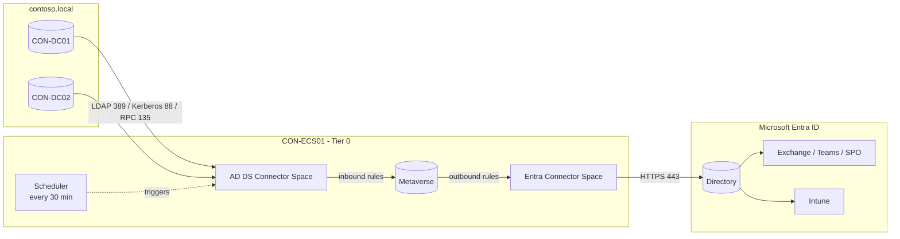

# 01 – Synchronize Users to Microsoft 365

> Part of the [Entra Connect playbook](../README.md). Related: [02 Single identity](../02-Single-Identity-Same-Username-Password/README.md) · [03 PHS](../03-Password-Hash-Synchronization/README.md) · [06 Groups](../06-Synchronize-Groups/README.md)

## Overview

Microsoft Entra Connect Sync (formerly Azure AD Connect Sync) reads user, group, contact, and device objects from AD DS. It projects them into a local metaverse and exports them to Microsoft Entra ID, where Microsoft 365 workloads (Exchange Online, Teams, SharePoint) and Intune consume them. On-premises AD stays the **source of authority**, so changes to synced attributes must be made on-premises.

Two sync engines exist. Choose one per object scope.

| Capability | Entra Connect Sync | Entra Cloud Sync |
|---|---|---|
| Footprint | Full sync engine + SQL LocalDB on a Windows Server | Lightweight provisioning agent(s), config held in the cloud |
| High availability | One active server + staging server(s) | Multiple active agents |
| Disconnected forests / M&A | No | Yes |
| Scale | No per-domain limit, groups up to 250,000 members | 150,000 objects per domain, groups up to 50,000 members |
| Device objects (Hybrid Join) | Yes | Yes (enabled separately) |
| Exchange hybrid writeback | Yes | Yes |
| Custom sync rules / complex transforms | Full rule editor | Attribute mapping + expressions |
| Pass-through authentication | Yes | No |
| Group provisioning to AD (cloud security groups) | No (writeback v2 deprecated) | **Yes** |
| Upgrades | Manual / auto-upgrade | Agent auto-updates |

> [!NOTE]
> Cloud Sync has closed most gaps with Connect Sync. It now supports device sync for hybrid join, and Microsoft publishes a **Connect Sync → Cloud Sync decision guide**. Re-check the comparison before new deployments.

> [!TIP]
> Contoso Healthcare runs a single forest with an existing Connect Sync build, Exchange hybrid and Hybrid Join ([04](../04-Hybrid-Microsoft-Entra-Join/README.md)), so it uses **Connect Sync** for users and devices. It also needs the full sync rule editor and 250K-member group support. It *adds* Cloud Sync later only to provision cloud security groups to AD ([06](../06-Synchronize-Groups/README.md)). Both engines can run side by side as long as their scopes don't overlap.

## How It Works (Architecture)

| Component | Role |
|---|---|
| **AD DS connector** (Connector Space) | Imports objects from `contoso.local` using the **AD DS Connector account** (`MSOL_xxxxxxxxxxxx` by default, or a custom account you supply) |
| **Metaverse** | Joined, consolidated view of each identity across connectors |
| **Microsoft Entra connector** | Exports to Entra ID. It authenticates with either the legacy **Entra Connector account** (`Sync_<server>_<id>@contoso.onmicrosoft.com`) or, since 2.5.x, **application-based authentication** (a certificate-backed app registration) |
| **ADSync service** | Runs as a virtual service account (`NT SERVICE\ADSync`) by default |
| **Scheduler** | Runs a delta sync cycle every **30 minutes** by default (the minimum) |
| **Sync rules** | Inbound/outbound rules (precedence < 100 = custom) that filter and transform attributes |



**Sync cycle (delta):**

1. AD import
2. AD delta sync
3. Entra import
4. Entra delta sync
5. Export to Entra ID
6. Export to AD (writeback attributes only)

A **full** cycle runs after rule or scope changes.

**Key network flows from the Connect server:**

| Destination | Port | Purpose |
|---|---|---|
| DCs | 53 DNS, 88 Kerberos, 135 + 49152–65535 RPC, 389 LDAP (636 LDAPS) | Import/export, password hash sync |
| DCs | 445 SMB, 3268 GC | Seamless SSO setup and password writeback |
| Internet | 443 HTTPS, 80 HTTP (CRL) | Entra ID, Connect Health |

**sourceAnchor and matching:**

- **sourceAnchor** is the immutable link between an AD object and its Entra object. Since version 1.1.524, the wizard uses `ms-DS-ConsistencyGuid`, populated from `objectGUID` on first sync. It then becomes the Entra `ImmutableId` (base64).
- **Soft match:** an existing cloud-only user is matched on `proxyAddresses` (SMTP) or `userPrincipalName` when no ImmutableId exists. For accounts holding admin roles, this is blocked by default.
- **Hard match:** you set the cloud user's `OnPremisesImmutableId` to the base64 of the AD object's `ms-DS-ConsistencyGuid`/`objectGUID`. Hard match can be blocked tenant-wide with the `BlockCloudObjectTakeoverThroughHardMatchEnabled` feature.

## Prerequisites

| Area | Requirement |
|---|---|
| Licensing | Any Microsoft 365 / Entra ID tier for sync. Entra ID **P1** for group-based licensing. |
| Forest | Forest functional level **Windows Server 2003 or later**. Writable DC reachable (RODCs not supported). |
| Server | Windows Server 2016/2019/2022 (2025 via in-place OS upgrade), domain-joined, **not** a DC, 4 GB+ RAM, PowerShell 5.0+, **.NET 4.7.2+**, **TLS 1.2** enabled. Up to 100,000 objects on SQL Express LocalDB (10 GB DB limit). |
| Install rights | Local Administrator on the server. **Enterprise Admin** in AD for Express settings (to create the connector account), or a pre-created AD DS connector account for Custom. |
| Entra rights | **Hybrid Identity Administrator** (Global Administrator no longer needed). |
| Network | Outbound 443/80 to Entra endpoints. No inbound ports from internet. |
| Tenant | Custom domain `contoso.com` **verified** in Entra ID. Directory sync is enabled by the wizard. |
| Hygiene | Run **IdFix** to correct duplicate `proxyAddresses`/UPNs and invalid characters before first sync. |

> [!NOTE]
> Connect Sync **2.6.84.0+** with **application-based authentication** is mandatory by **April 7, 2027**. New installs from 2.5.76.0 onward set up application-based authentication automatically. Download the MSI only from **Entra admin center > Entra ID > Entra Connect > Get started**.

## Step-by-Step Workflow

1. **Prepare AD**
   1. Verify UPN suffix `contoso.com` exists (**Active Directory Domains and Trusts > right-click root > Properties > UPN Suffixes**). See [02](../02-Single-Identity-Same-Username-Password/README.md).
   2. Set every in-scope user's UPN to `@contoso.com` and `mail` to their primary SMTP.
   3. Move accounts that must not sync to `Non-Synced`.
2. **Download**: in **Entra admin center > Entra ID > Entra Connect > Get started**, select **Download Connect Sync Agent**.
3. **Install** on `CON-ECS01`: run `AzureADConnect.msi`, accept the license, choose **Customize** (not Express, so you can scope OUs).
4. **Required components**: leave defaults (LocalDB, virtual service account) unless you have a dedicated SQL server or gMSA.
5. **User sign-in**: select **Password Hash Synchronization** and **Enable single sign-on** (see [03](../03-Password-Hash-Synchronization/README.md), [08](../08-Seamless-SSO/README.md)).
6. **Connect to Microsoft Entra ID**: sign in as a Hybrid Identity Administrator. On current versions the wizard registers the application-based credential.
7. **Connect your directories**: add `contoso.local` and choose **Create new AD account** (Enterprise Admin creds) or **Use existing AD account**.
8. **Microsoft Entra sign-in configuration**: confirm `contoso.com` shows **Verified**, and select `userPrincipalName` as the on-premises attribute to use as the Entra username.
9. **Domain and OU filtering**: select **Sync selected domains and OUs**, tick `Corp` and its children, and untick `Non-Synced`.
10. **Uniquely identifying your users**: "Users are represented only once across all directories". sourceAnchor = **Let Azure manage the source anchor** (`ms-DS-ConsistencyGuid`).
11. **Filter users and devices**: *Synchronize all users and devices*, or pilot with a group (pilot only; group filtering is not supported in production).
12. **Optional features**: tick *Password hash synchronization*. Tick *Password writeback* (P1, see [09](../09-Password-Writeback/README.md)) and *Exchange hybrid deployment* if required.
13. **Ready to configure**: **untick "Start the synchronization process when configuration completes"** for the first install so you can review the pending exports. Then click **Install**.
14. **Review**: open **Synchronization Service Manager** (Start > *Synchronization Service*), run Full Import + Full Sync on both connectors, then inspect *pending export* in the Entra connector space.
15. **Enable the scheduler**: `Set-ADSyncScheduler -SyncCycleEnabled $true`.
16. **License**: in **Entra admin center > Entra ID > Groups > All groups > GRP-Lic-M365E5 > Licenses > + Assignments**, assign Microsoft 365 E5. Synced users need `usageLocation` set first (sync it from `c` or set a default).

## PowerShell / CLI Reference

```powershell
# Load the sync module (installed with Entra Connect)
Import-Module ADSync

# Show scheduler state, interval, staging mode and next run
Get-ADSyncScheduler

# Trigger a delta cycle (normal after any AD change)
Start-ADSyncSyncCycle -PolicyType Delta

# Trigger a full cycle (after changing OU filters or sync rules)
Start-ADSyncSyncCycle -PolicyType Initial

# Pause and resume the scheduler during maintenance
Set-ADSyncScheduler -SyncCycleEnabled $false
Set-ADSyncScheduler -SyncCycleEnabled $true

# List connectors and their partitions / OU inclusions
Get-ADSyncConnector | Select-Object Name, Type
(Get-ADSyncConnector -Name "contoso.local").Partitions.ConnectorPartitionScope.ContainerInclusionList

# Show which credential the Entra connector uses (ServiceAccount vs Application)
Get-ADSyncEntraConnectorCredential

# Show the last run profile results for each connector
Get-ADSyncRunProfileResult -NumberRequested 5 | Select-Object ConnectorName, RunProfileName, Result, StartDate

# Export the full server configuration (useful for documenting / comparing staging)
Get-ADSyncServerConfiguration -Path "C:\ADSyncConfig\$(Get-Date -f yyyyMMdd)"

# Accidental-delete protection threshold (default 500)
Get-ADSyncExportDeletionThreshold
```

```powershell
# Read ms-DS-ConsistencyGuid for a user and convert to the Entra ImmutableId (hard match)
$u = Get-ADUser alex.wilber -Properties 'mS-DS-ConsistencyGuid', objectGUID
$guid = if ($u.'mS-DS-ConsistencyGuid') { $u.'mS-DS-ConsistencyGuid' } else { $u.ObjectGUID.ToByteArray() }
[System.Convert]::ToBase64String($guid)          # value to stamp as OnPremisesImmutableId

# Microsoft Graph: inspect a synced user and its sync metadata
Connect-MgGraph -Scopes "User.Read.All","Directory.Read.All"
Get-MgUser -UserId alex.wilber@contoso.com -Property OnPremisesSyncEnabled,OnPremisesImmutableId,OnPremisesLastSyncDateTime,UsageLocation |
  Format-List OnPremises*,UsageLocation

# Microsoft Graph: tenant-level sync status and last sync time
Get-MgOrganization | Select-Object OnPremisesSyncEnabled, OnPremisesLastSyncDateTime
```

## Enterprise Lab

### Scenario

Contoso Healthcare (~5,000 users, Seattle HQ plus two hospitals and 12 clinics) is moving mail to Exchange Online. Only `Corp` users may sync. The `Non-Synced` OU holds legacy and test accounts that must never reach the cloud. Licensing must be automatic through group membership.

### Lab Environment

Use the [shared lab](../README.md#shared-lab-environment--contoso-healthcare). This lab uses `CON-DC01`, `CON-ECS01`, `CON-ECS02`, the `Corp` and `Non-Synced` OUs, and `GRP-Lic-M365E5`.

### Objectives

1. 100% of users in `Corp/Users` appear in Entra ID with `OnPremisesSyncEnabled = True` within one sync cycle.
2. 0 objects from `Non-Synced` appear in Entra ID.
3. One pre-existing cloud-only user (`alex.wilber`) is **soft-matched**, not duplicated.
4. Licenses are applied through `GRP-Lic-M365E5` with no direct assignments.
5. `CON-ECS02` holds an identical configuration in staging mode.

### Lab Tasks

| # | Task | Steps | Expected result |
|---|---|---|---|
| 1 | Create the pre-existing cloud user | Entra admin center > Users > New user > `alex.wilber@contoso.com`, set `proxyAddresses` via Exchange (add a mailbox) | Cloud-only user exists |
| 2 | Run IdFix | Run IdFix against `contoso.local`, fix duplicates/format errors | 0 errors |
| 3 | Install Connect on ECS01 | Workflow steps 2–13, OU filter `Corp` only | Wizard completes, scheduler disabled |
| 4 | Review pending exports | Sync Service Manager > Connectors > *Entra* > Search Connector Space > *Pending Export* | Only `Corp` objects. `alex.wilber` is an **update**, not an **add**. |
| 5 | Enable sync | `Set-ADSyncScheduler -SyncCycleEnabled $true`; `Start-ADSyncSyncCycle -PolicyType Delta` | Export succeeds, no errors |
| 6 | Group-based licensing | Assign E5 to `GRP-Lic-M365E5`, add 10 test users in AD, run delta | Users show license **Inherited** |
| 7 | Build staging server | Install on ECS02 with the same choices, tick **Enable staging mode** on the *Ready to configure* page | `Get-ADSyncScheduler` shows `StagingModeEnabled : True` |

### Validation

- **Portal**: open **Entra admin center > Entra ID > Entra Connect > Connect sync**. Last sync is < 30 minutes ago, and *Password Hash Sync* is Enabled. **Users > All users** has a filter *On-premises sync enabled = Yes*.
- **Sync logs**: in **Synchronization Service Manager > Operations**, all run profiles show `success`, and *Export* to Entra shows Adds/Updates.
- **Metaverse**: open **Metaverse Search**, set `userPrincipalName` = `alex.wilber@contoso.com`, and confirm one object joined to both connectors.
- **Audit logs**: in **Entra admin center > Monitoring & health > Audit logs**, filter on Initiated by = `Sync_…` or the Connect application. You should see `Update user` (not `Add user`) for alex.wilber.
- **Graph**: `Get-MgUser` shows `OnPremisesImmutableId` populated for alex.wilber.

### Break/Fix Exercise

| | |
|---|---|
| **Failure** | Add `test.legacy`'s SMTP address to a `Corp` user's `proxyAddresses`, so the same value is on two objects. |
| **Symptoms** | Export error **AttributeValueMustBeUnique** in Sync Service Manager, an email from Entra ID, and an entry in **Entra Connect > Connect Health > Sync errors > Duplicate attribute**. |
| **Diagnosis** | Sync Service Manager > Operations > Export > error link shows the conflicting value and object. Entra Connect Health shows both objects side by side. |
| **Fix** | Remove the duplicate value in AD, then run `Start-ADSyncSyncCycle -PolicyType Delta`. The error clears on the next export. |

### Cleanup/Rollback

- To remove sync for test objects, move them to `Non-Synced` and run delta. The cloud object is **soft-deleted** (restorable for 30 days).
- To roll back the whole lab, uninstall Entra Connect (**Settings > Apps**), then disable directory sync with Graph: `Update-MgOrganization -OrganizationId <id> -OnPremisesSyncEnabled:$false`.

  > [!WARNING]
  > This converts *all* synced objects to cloud-managed. It is effectively irreversible for days (up to 72 hours to process).

## Troubleshooting

| Symptom | Cause | Resolution |
|---|---|---|
| Duplicate users (`alex.wilber` and `alex.wilber1234`) | Soft match failed (UPN/SMTP mismatch, or target had an admin role) | Delete the duplicate synced user, align UPN/SMTP, or hard match via ImmutableId |
| `stopped-deletion-threshold` | More than 500 deletes in one export | Confirm intent, then `Disable-ADSyncExportDeletionThreshold`, run sync, then re-enable |
| `InvalidSoftMatch` | Cloud user already has a different ImmutableId | Clear or correct `OnPremisesImmutableId` on the cloud user |
| Users not licensed | `usageLocation` missing, or license conflict | Sync `c` → usageLocation, or set a tenant default. Check group license errors. |
| `no-start-ma` / `stopped-server-down` | DC unreachable, credential expired | Check ports 389/88/135 to DCs and the AD DS connector account password |
| Wizard fails to authenticate | Version < 2.4.18.0 after the MSOnline retirement | Upgrade to the current version from the Entra admin center |

**Event IDs and logs:**

| Source | Location / ID | Meaning |
|---|---|---|
| Application log – `ADSync` | 6100 and other 61xx IDs | Run profile / management agent failures |
| Application log – `Directory Synchronization` | 611 (failure), 656/657 (change sent) | PHS errors and activity (see [03](../03-Password-Hash-Synchronization/README.md)) |
| Wizard trace | `%ProgramData%\AADConnect\trace-*.log` | Install/config failures |
| Sync Service Manager | Operations tab | Per-run counts and per-object errors |

## Security & Best Practices

- **Treat `CON-ECS01/02` as Tier 0.** They can read password hashes and write to AD. Admin them only from PAWs, put them in a Tier 0 OU with restricted GPOs, and add no other server roles or agents beyond EDR.
- **Least privilege:** use a custom AD DS connector account with only the permissions each feature needs (see [09](../09-Password-Writeback/README.md)). Use **Hybrid Identity Administrator**, not Global Administrator.
- **Application-based authentication:** move from the `Sync_*` service account to a certificate credential (TPM-backed where possible), then remove the old account's Directory Synchronization Accounts role.
- **Staging mode:** keep a configured staging server for disaster recovery and to preview rule changes (pending export review) before going live.
- **Entra Connect Health:** install the agent for sync error alerting and object-level duplicate attribute reports.
- **Accidental-delete protection:** leave the threshold enabled (default 500). Lower it for a 5,000-user tenant if desired.
- **Zero Trust:** sync only what is needed. Never sync privileged on-premises admin accounts. Cloud admin accounts should be cloud-only.

## Interview / Exam Notes

- The default sync interval is **30 minutes**. Force it with `Start-ADSyncSyncCycle -PolicyType Delta` (or `Initial` after filter changes).
- The sourceAnchor default is **`ms-DS-ConsistencyGuid`**, which maps to `ImmutableId`. Changing it after deployment is unsupported without a rebuild.
- **Soft match** = SMTP/UPN. **Hard match** = ImmutableId. Soft match onto admin-role accounts is blocked by default.
- **Group-based filtering** in the wizard is for **pilots only**. Use OU or attribute filtering in production.
- **Staging mode** imports and syncs but does **not export**. Use it for DR and change validation.
- **Hybrid Identity Administrator** is enough to configure Connect. **Enterprise Admin** is needed only to create the AD DS connector account and SCP.
- Accidental-delete threshold: **500** objects by default.
- Know the deadline: **2.6.84.0 + application-based authentication by April 7, 2027**.

## References

- [What is Microsoft Entra Connect?](https://learn.microsoft.com/entra/identity/hybrid/connect/whatis-azure-ad-connect)
- [Prerequisites for Microsoft Entra Connect](https://learn.microsoft.com/entra/identity/hybrid/connect/how-to-connect-install-prerequisites)
- [Custom installation of Microsoft Entra Connect](https://learn.microsoft.com/entra/identity/hybrid/connect/how-to-connect-install-custom)
- [Design concepts – sourceAnchor and ms-DS-ConsistencyGuid](https://learn.microsoft.com/entra/identity/hybrid/connect/plan-connect-design-concepts)
- [Filtering configuration](https://learn.microsoft.com/entra/identity/hybrid/connect/how-to-connect-sync-configure-filtering)
- [Scheduler](https://learn.microsoft.com/entra/identity/hybrid/connect/how-to-connect-sync-feature-scheduler)
- [Soft and hard matching (user matching)](https://learn.microsoft.com/entra/identity/hybrid/connect/how-to-connect-install-existing-tenant)
- [Application-based authentication](https://learn.microsoft.com/entra/identity/hybrid/connect/authenticate-application-id)
- [Group-based licensing](https://learn.microsoft.com/entra/identity/users/licensing-groups-assign)
- [What is Microsoft Entra Cloud Sync?](https://learn.microsoft.com/entra/identity/hybrid/cloud-sync/what-is-cloud-sync)
- [Migrate from Connect Sync to Cloud Sync: decision guide](https://learn.microsoft.com/entra/identity/hybrid/cloud-sync/connect-to-cloud-sync-decision-guide)
- [Prevent accidental deletes](https://learn.microsoft.com/entra/identity/hybrid/connect/how-to-connect-sync-feature-prevent-accidental-deletes)
