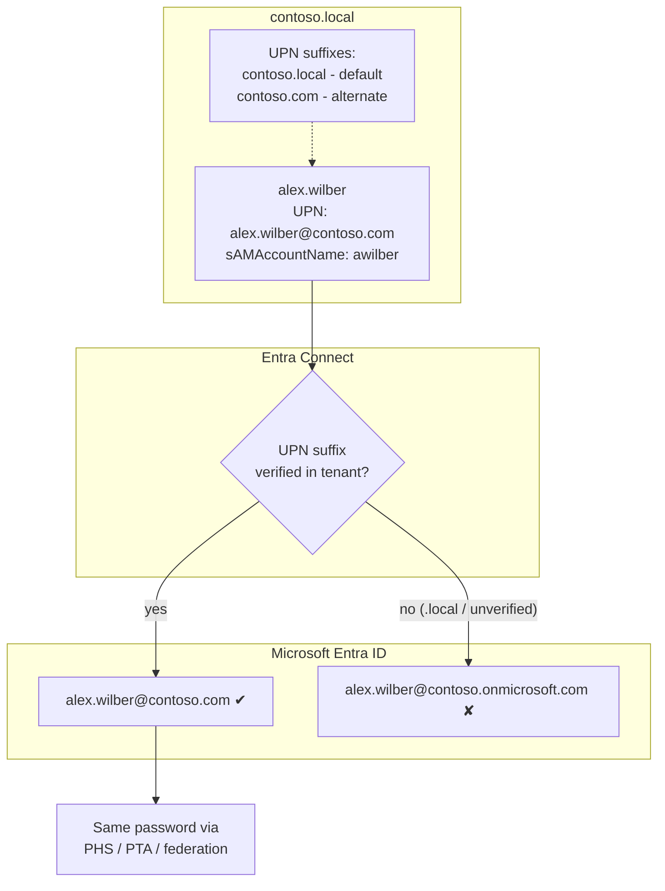

# 02 – Single Identity: Same Username and Password

> Part of the [Entra Connect playbook](../README.md). Related: [01 Sync users](../01-Synchronize-Users-to-Microsoft-365/README.md) · [03 PHS](../03-Password-Hash-Synchronization/README.md) · [08 Seamless SSO](../08-Seamless-SSO/README.md) · [09 Password writeback](../09-Password-Writeback/README.md)

## Overview

A *single identity* means a user signs in to Windows, on-premises apps, Microsoft 365, and any Entra-integrated SaaS app with **one username (`alex.wilber@contoso.com`) and one password**. Two settings make this work:

1. **Username alignment**: the on-premises `userPrincipalName` (UPN) uses a routable, verified domain that becomes the Entra sign-in name.
2. **Password alignment**: one of three hybrid authentication methods makes the cloud accept the on-premises password.

| Method | Where the password is validated | On-premises dependency at sign-in | Notes |
|---|---|---|---|
| **Password hash sync (PHS)** | Entra ID (hash of hash) | None | Recommended default. Enables leaked credential detection. See [03](../03-Password-Hash-Synchronization/README.md). |
| **Pass-through authentication (PTA)** | On-premises DC via PTA agents | Agents + DCs must be up | Use when policy forbids any hash leaving on-premises, or AD logon hours must apply immediately. Enable PHS as a backup. |
| **Federation (AD FS)** | AD FS farm | AD FS + WAP + DCs | Only for requirements Entra cannot meet natively (e.g. certain third-party MFA or smart card flows). Microsoft recommends migrating off it ([10](../10-Support-Cloud-Migration/README.md)). |

Same-sign-on vs. single sign-on:

- **Same sign-on:** the same credentials are typed again in each place. PHS or PTA alone gives you this.
- **Single sign-on:** credentials are not prompted again on corporate devices. Add **Seamless SSO** ([08](../08-Seamless-SSO/README.md)) for domain-joined devices, or the **Primary Refresh Token (PRT)** on Hybrid/Entra-joined Windows ([04](../04-Hybrid-Microsoft-Entra-Join/README.md)).

> [!TIP]
> Users often type `CONTOSO\alex.wilber` (the down-level logon name). Teach them to use their email-style UPN everywhere. Windows accepts `alex.wilber@contoso.com` at the logon screen, and it matches the cloud.

## How It Works (Architecture)

**UPN flow:** The AD attribute `userPrincipalName` is exported to the Entra `userPrincipalName` only when its suffix matches a **verified** custom domain. If the suffix is unverified or non-routable (e.g. `contoso.local`), Entra substitutes `alex.wilber@contoso.onmicrosoft.com`. Users then have two different names.

**Alternate login ID:** If changing UPNs is impossible (an application binds on UPN), the wizard can map Entra `userPrincipalName` from another attribute such as `mail`. This is supported but adds friction: Windows logon still uses the AD UPN, and Seamless SSO/Hybrid Join scenarios need extra configuration. Changing the UPN is preferred.



| Account / component | Purpose |
|---|---|
| AD DS Connector account | Reads `userPrincipalName`, `mail`, `proxyAddresses`. Reads password hashes for PHS. |
| Entra Connector account / application credential | Writes UPN changes to Entra ID |
| UPN suffix list (`uPNSuffixes` on `CN=Partitions,CN=Configuration`) | Defines which suffixes admins can assign |

> [!NOTE]
> **UPN changes on synced users.** Historically, UPN changes to licensed synced users did not flow to Entra ID unless the `SynchronizeUpnForManagedUsers` feature was enabled. That has been on by default for tenants created since 2017. Check it with `Get-MgDirectoryOnPremiseSynchronization` (feature `synchronizeUpnForManagedUsersEnabled`). It cannot be turned off once enabled.

## Prerequisites

| Area | Requirement |
|---|---|
| DNS / registrar | Ability to add a TXT (or MX) record in the public `contoso.com` zone |
| Entra | `contoso.com` added and **verified** in **Entra admin center > Entra ID > Domain names**. Role: Domain Name Administrator or Global Administrator. |
| AD | Enterprise Admin (or delegated) to add UPN suffixes. Account Operators / delegated OU rights to change user UPNs. |
| Applications | Inventory of apps that authenticate with UPN or `DOMAIN\user`. Test them before mass UPN changes. |
| Licensing | No extra license for the UPN change. PTA/PHS/Seamless SSO are included in Entra ID Free. |
| Network | None beyond [01](../01-Synchronize-Users-to-Microsoft-365/README.md). PTA agents need outbound 443 only. |

## Step-by-Step Workflow

1. **Verify the domain in Entra**
   1. **Entra admin center > Entra ID > Domain names > + Add custom domain** and enter `contoso.com`.
   2. Add the shown `TXT MS=msXXXXXXXX` record at the DNS registrar, then click **Verify**.
2. **Add the UPN suffix in AD**
   1. On `CON-DC01`, open **Active Directory Domains and Trusts**.
   2. Right-click **Active Directory Domains and Trusts** (the root) > **Properties** > **UPN Suffixes**.
   3. Add `contoso.com` > **OK**.
3. **Audit current UPNs**: run the report script below and export users whose suffix is `contoso.local`.
4. **Pilot the change**: in **Active Directory Users and Computers > Corp/Users/IT > lee.gu > Properties > Account**, choose the `@contoso.com` suffix in the **User logon name** drop-down.
5. **Bulk change**: run the PowerShell bulk UPN script by OU, department by department, outside clinical shift change.
6. **Align mail**: confirm `mail` and the primary `SMTP:` in `proxyAddresses` equal the new UPN (one name for email and sign-in).
7. **Sync**: `Start-ADSyncSyncCycle -PolicyType Delta`. Confirm in Entra that the UPN changed.
8. **Choose the sign-in method**: in the Entra Connect wizard, **Configure > Change user sign-in > Password Hash Synchronization** (+ **Enable single sign-on**).
9. **Communicate**: tell users their sign-in name is their email address.
10. **Validate sign-in** at <https://myapps.microsoft.com> with the AD password.

## PowerShell / CLI Reference

```powershell
# List UPN suffixes defined in the forest
Get-ADForest | Select-Object -ExpandProperty UPNSuffixes

# Add the routable suffix to the forest
Set-ADForest -Identity contoso.local -UPNSuffixes @{Add = "contoso.com"}

# Report users still on the non-routable suffix
Get-ADUser -Filter "UserPrincipalName -like '*@contoso.local'" -SearchBase "OU=Corp,DC=contoso,DC=local" |
  Select-Object SamAccountName, UserPrincipalName | Export-Csv C:\Temp\upn-local.csv -NoTypeInformation

# Bulk-change UPN suffix for one OU (run with -WhatIf first)
Get-ADUser -Filter "UserPrincipalName -like '*@contoso.local'" -SearchBase "OU=Finance,OU=Users,OU=Corp,DC=contoso,DC=local" |
  ForEach-Object {
    $new = $_.UserPrincipalName -replace '@contoso\.local$', '@contoso.com'
    Set-ADUser $_ -UserPrincipalName $new -WhatIf      # remove -WhatIf to apply
  }

# Find mismatches between UPN and mail (should be zero after alignment)
Get-ADUser -Filter * -SearchBase "OU=Corp,DC=contoso,DC=local" -Properties mail |
  Where-Object { $_.mail -and $_.mail -ne $_.UserPrincipalName } | Select-Object Name, UserPrincipalName, mail

# Push the change to Entra ID now
Start-ADSyncSyncCycle -PolicyType Delta
```

```powershell
# Microsoft Graph: list domains and their verification state
Connect-MgGraph -Scopes "Domain.Read.All","User.Read.All","OnPremDirectorySynchronization.Read.All"
Get-MgDomain | Select-Object Id, IsVerified, AuthenticationType   # AuthenticationType: Managed or Federated

# Find synced users still on the onmicrosoft.com fallback (UPN not aligned)
Get-MgUser -All -Filter "onPremisesSyncEnabled eq true" -Property UserPrincipalName,OnPremisesUserPrincipalName |
  Where-Object UserPrincipalName -like "*onmicrosoft.com" | Select-Object UserPrincipalName, OnPremisesUserPrincipalName

# Confirm UPN updates for managed users are synced
(Get-MgDirectoryOnPremiseSynchronization).Features | Select-Object SynchronizeUpnForManagedUsersEnabled
```

## Enterprise Lab

### Scenario

Contoso Healthcare's forest was built as `contoso.local`. Clinicians sign in to Windows as `CONTOSO\awilber` and to Microsoft 365 as `alex.wilber@contoso.onmicrosoft.com`. The help desk logs about 400 "which password/username?" tickets a month. Leadership wants one sign-in name equal to the email address across all 5,000 users, with no forest rename.

### Lab Environment

Use the [shared lab](../README.md#shared-lab-environment--contoso-healthcare): `CON-DC01`, `CON-ECS01`, the `Corp/Users/*` OUs, and the test users `alex.wilber`, `megan.bowen`, `lee.gu`.

### Objectives

1. `contoso.com` is verified in Entra and present as a UPN suffix in AD.
2. 100% of `Corp` users have UPN = mail = `first.last@contoso.com`.
3. 0 synced users have an `onmicrosoft.com` UPN (Graph report returns nothing).
4. Test users sign in to Windows and Microsoft 365 with the same UPN and password.

### Lab Tasks

| # | Task | Steps | Expected result |
|---|---|---|---|
| 1 | Verify domain | Workflow step 1 | `Get-MgDomain` → `contoso.com IsVerified True` |
| 2 | Add suffix | `Set-ADForest … -UPNSuffixes @{Add="contoso.com"}` | `Get-ADForest` lists `contoso.com` |
| 3 | Baseline report | Run the `.local` report and the Graph `onmicrosoft.com` report | CSV of users to fix |
| 4 | Pilot | Change `lee.gu` only, run delta | Entra UPN becomes `lee.gu@contoso.com` within one cycle |
| 5 | Bulk change | Run the bulk script per OU (`-WhatIf` first) | All `Corp` users on `@contoso.com` |
| 6 | Align mail | Run the mismatch report and fix `mail`/`proxyAddresses` | Report returns 0 rows |
| 7 | Test sign-in | Sign in to `CON-WS-0001` as `alex.wilber@contoso.com`, then browse to `office.com` | Same password works everywhere |

### Validation

- **Portal**: **Entra admin center > Users > All users**: filter `On-premises sync enabled = Yes`. No UPN ends with `onmicrosoft.com`.
- **Sync logs**: in **Synchronization Service Manager > Operations**, the delta export shows **Updates** equal to the number of changed users. No `InvalidUserPrincipalName` / `InvalidSoftMatch` errors appear.
- **Metaverse**: search `userPrincipalName` ends with `contoso.local`. It should return 0.
- **Sign-in logs**: **Entra admin center > Monitoring & health > Sign-in logs**: alex.wilber shows **Success**, and *Authentication Details* shows *Password Hash Sync*.
- **Client**: `whoami /upn` on the workstation returns `alex.wilber@contoso.com`.

### Break/Fix Exercise

| | |
|---|---|
| **Failure** | Set `megan.bowen`'s UPN to `megan.bowen@contosohealth.com`, a suffix added in AD but **not verified** in Entra. |
| **Symptoms** | After sync, Entra shows `megan.bowen@contoso.onmicrosoft.com`. The user cannot sign in with the new name, and Outlook prompts repeatedly. |
| **Diagnosis** | `Get-MgUser` shows `OnPremisesUserPrincipalName` = `@contosohealth.com` but `UserPrincipalName` = `@contoso.onmicrosoft.com`. `Get-MgDomain` doesn't list the suffix as verified. |
| **Fix** | Either verify `contosohealth.com` in Entra, or revert the AD UPN to `@contoso.com`. Then run delta sync. |

### Cleanup/Rollback

- Revert pilot UPNs by re-running the bulk script with the pattern reversed (`@contoso.com` → `@contoso.local`). Keep the CSV from task 3 as the rollback source.
- Removing the `contoso.com` UPN suffix from AD fails while users still use it. Revert the users first.

> [!WARNING]
> Changing a UPN changes the user's OneDrive URL and can break cached credentials in apps that store UPN (e.g. some EHR thick clients). Pilot with IT, then one clinic, before hospitals.

## Troubleshooting

| Symptom | Cause | Resolution |
|---|---|---|
| Entra UPN is `@onmicrosoft.com` | AD UPN suffix not verified / non-routable | Verify the domain or change the AD UPN to a verified suffix |
| UPN change in AD not reflected in Entra | `SynchronizeUpnForManagedUsers` disabled (very old tenants), or federated domain | Enable the feature via Graph. For federated users, change via sync after the domain cutover. |
| User cannot sign in after UPN change | Cached old UPN in Office/OneDrive | Sign out of Office apps, clear the Credential Manager entries |
| `InvalidUserPrincipalName` export error | Unsupported characters (e.g. space, `&`), or > 113 chars | Fix with IdFix, then resync |
| Two accounts per user after alignment | Soft match failed because SMTP/UPN differ | See [01](../01-Synchronize-Users-to-Microsoft-365/README.md) soft/hard match |
| PTA sign-ins fail but PHS works | PTA agents down or blocked | Check **Entra Connect > Pass-through authentication** agent status, outbound 443 |

**Logs:** Entra Connect wizard `%ProgramData%\AADConnect\trace-*.log`. Application log `ADSync`. Entra **Audit logs** (Category *UserManagement*, Activity *Update user*). Entra **Sign-in logs** (error 50126 = invalid username or password).

## Security & Best Practices

- **Never sync the same identity for on-premises Domain Admins and cloud admins.** Cloud privileged roles use separate cloud-only accounts.
- Prefer **PHS** even with PTA or federation: it gives leaked-credential detection and a sign-in fallback ([03](../03-Password-Hash-Synchronization/README.md)).
- Put the Entra Connect and PTA agent servers in **Tier 0** and restrict who can change UPN suffixes (Enterprise Admins only).
- **Least privilege for UPN changes:** delegate *Write userPrincipalName* on `Corp/Users` to the identity team only. A UPN change effectively renames an identity.
- **Zero Trust:** one identity means one place to enforce MFA and Conditional Access. Combine it with Seamless SSO/PRT so MFA prompts are risk-based, not habitual.
- Use **Entra Connect Health** to alert on UPN conflict and duplicate attribute sync errors.

## Interview / Exam Notes

- Entra uses the AD `userPrincipalName` only if its suffix is a **verified** domain. Otherwise it falls back to `onmicrosoft.com`.
- `.local` is **non-routable** and cannot be verified. Add an alternate UPN suffix rather than renaming the forest.
- **Alternate login ID** (mapping `mail` to the Entra UPN) is supported but is a last resort.
- Choose PHS unless there is a hard requirement. For PTA, Microsoft recommends **at least 3 agents** for HA in production. Federation adds the most infrastructure.
- **Same sign-on ≠ single sign-on.** SSO needs Seamless SSO or a PRT (Hybrid/Entra joined).
- UPN and primary SMTP should match to avoid soft-match and Outlook autodiscover confusion.
- A domain's `AuthenticationType` (Managed/Federated) is per domain: `Get-MgDomain`.

## References

- [Prepare a non-routable domain for directory synchronization](https://learn.microsoft.com/microsoft-365/enterprise/prepare-a-non-routable-domain-for-directory-synchronization)
- [Microsoft Entra UserPrincipalName population](https://learn.microsoft.com/entra/identity/hybrid/connect/plan-connect-userprincipalname)
- [Add your custom domain name](https://learn.microsoft.com/entra/fundamentals/add-custom-domain)
- [Choose the right authentication method](https://learn.microsoft.com/entra/identity/hybrid/connect/choose-ad-authn)
- [Pass-through authentication](https://learn.microsoft.com/entra/identity/hybrid/connect/how-to-connect-pta)
- [Sign in with email as an alternate login ID](https://learn.microsoft.com/entra/identity/authentication/howto-authentication-use-email-signin)
- [Sync features: synchronizeUpnForManagedUsers](https://learn.microsoft.com/entra/identity/hybrid/connect/how-to-connect-syncservice-features)
- [IdFix tool](https://learn.microsoft.com/microsoft-365/enterprise/set-up-directory-synchronization)
