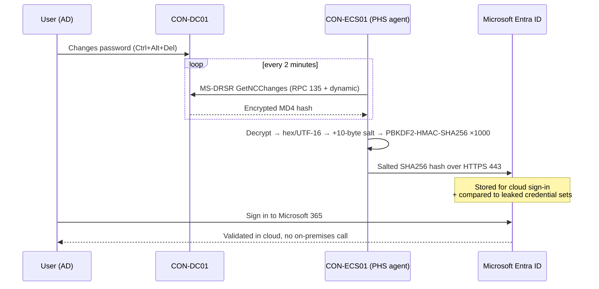

# 03 – Password Hash Synchronization (PHS)

> Part of the [Entra Connect playbook](../README.md). Related: [02 Single identity](../02-Single-Identity-Same-Username-Password/README.md) · [08 Seamless SSO](../08-Seamless-SSO/README.md) · [09 Password writeback](../09-Password-Writeback/README.md) · [10 Cloud migration](../10-Support-Cloud-Migration/README.md)

## Overview

Password hash synchronization syncs a **hash of the hash** of each user's AD password to Microsoft Entra ID. Users then sign in to the cloud with their on-premises password, and Entra ID validates it **without contacting on-premises infrastructure**. Microsoft recommends PHS as the default hybrid authentication method. Even when PTA or federation is the primary method, enabling PHS adds:

- **Leaked credential detection** (Microsoft Entra ID Protection, P2 for risk policies)
- **Sign-in resilience**: switch to PHS if AD FS or PTA agents are down
- **A migration path** off federation through staged rollout ([10](../10-Support-Cloud-Migration/README.md))

| | PHS | PTA | Federation (AD FS) |
|---|---|---|---|
| Validation | Cloud | On-premises DC via agent | On-premises AD FS |
| Survives on-premises outage | **Yes** | No | No |
| Leaked credential detection | **Yes** | Only if PHS also enabled | Only if PHS also enabled |
| Immediate AD account disable/lockout honored | Up to next sync (disable state) | Yes | Yes |
| Extra servers | None | ≥ 3 PTA agents recommended | AD FS farm + WAP |
| Smart card / third-party MFA on-premises | No (use Entra CBA) | No | Yes |

> [!TIP]
> The common objection is "account disable should apply instantly." Close the gap with the **user disable event** (sync runs every 30 minutes, or trigger a delta). Add **Continuous Access Evaluation** and the **Revoke sessions** action in the leaver runbook. This is usually more effective than keeping PTA or federation.

## How It Works (Architecture)

1. Every **2 minutes**, the PHS agent inside the ADSync service requests password hashes from a DC. It uses the **MS-DRSR** replication protocol (the same API DCs use to replicate). This is why the AD DS Connector account needs *Replicating Directory Changes* and *Replicating Directory Changes All*.
2. The DC returns the **MD4 (NT) hash** encrypted with a key derived from the RPC session key.
3. The Connect server decrypts it, then:
   1. Converts the 16-byte binary hash to a 32-byte hex string, then encodes it as UTF-16 bytes.
   2. Adds a **per-user 10-byte salt**.
   3. Runs **PBKDF2 with HMAC-SHA256, 1,000 iterations**.
4. The resulting hash, the salt, and the iteration count are sent to Entra ID over **TLS (443)**.
5. At sign-in, Entra ID runs the user's typed password through the same process and compares the results.

The original MD4 hash is never sent to Entra ID, and hashes are **never stored in the ADSync SQL database**. PHS runs **independently of the 30-minute sync scheduler**. Its interval cannot be changed.



**Password policy behavior:**

| Aspect | Behavior |
|---|---|
| Complexity | AD policy applies. Entra accepts whatever was synced. |
| Expiration | By default, synced users' cloud passwords are set to **never expire**, whatever AD says. Enable `CloudPasswordPolicyForPasswordSyncedUsersEnabled` to apply the Entra domain expiry policy. |
| "Must change password at next logon" | Synced only when `UserForcePasswordChangeOnLogonEnabled` is enabled (and the user has a temp password set by an admin) |
| Account expiration (`accountExpires`) | Not synced. Disable the account instead. |
| Disabled user | `accountEnabled=false` flows on the normal sync cycle |

> [!NOTE]
> When enabling `CloudPasswordPolicyForPasswordSyncedUsersEnabled`, align the Entra domain password validity (`Update-MgDomain -PasswordValidityPeriodInDays`) with AD, or users may be told to change passwords at unexpected times. Users who need non-expiring cloud passwords (e.g. sync service accounts) must get `DisablePasswordExpiration` explicitly.

## Prerequisites

| Area | Requirement |
|---|---|
| Licensing | Entra ID Free for PHS. **Entra ID P2** for ID Protection risk policies using leaked credentials (the detection itself appears in reports for P1). |
| AD permissions | AD DS Connector account: **Replicating Directory Changes** + **Replicating Directory Changes All** on each domain root. The Express install grants them automatically. For custom accounts, use `Set-ADSyncPasswordHashSyncPermissions`. |
| Forest | FFL 2003+. Must contact a **writable DC**. |
| Network | Connect server → DCs: RPC 135 + dynamic 49152–65535, LDAP 389, Kerberos 88, DNS 53. Connect server → Entra: 443. |
| FIPS | If FIPS mode is enforced on the server, set `<enforceFIPSPolicy enabled="false"/>` in `miiserver.exe.config` (MD5 is used internally). |
| Unsupported | `iNetOrgPerson` objects. |

## Step-by-Step Workflow

1. **Check the current method**: **Entra admin center > Entra ID > Entra Connect > Connect sync**. Review *User sign-in*: Password Hash Sync Enabled/Disabled.
2. **(Recommended) Enable cloud password expiry first**, before users get hashes, so expiry behaves from day one (Graph commands below).
3. **Open the wizard** on `CON-ECS01`: **Microsoft Entra Connect > Configure > Change user sign-in > Next**, then sign in as Hybrid Identity Administrator.
4. Select **Password Hash Synchronization**. Optionally tick **Enable single sign-on** ([08](../08-Seamless-SSO/README.md)) > **Next** > **Configure**.
   - *If PTA or federation stays primary:* instead use **Configure > Customize synchronization options > Optional features** and tick only **Password hash synchronization**.
5. **Trigger an initial full password sync** (optional; the wizard already queues one) with the "full password sync" script below.
6. **Confirm the heartbeat**: Application log, source *Directory Synchronization*, event **656/657** entries appear as passwords change.
7. **Verify leaked credentials reporting**: **Entra admin center > Protection > Identity Protection > Risk detections**, filter *Leaked credentials*.
8. **Apply a risk policy** (P2): **Protection > Conditional Access > New policy**. Grant *Require risk remediation*, user risk *High*. Target pilot users first.

## PowerShell / CLI Reference

```powershell
Import-Module ADSync

# Is PHS enabled on the AD connector?
Get-ADSyncAADPasswordSyncConfiguration -SourceConnector "contoso.local"

# Built-in PHS troubleshooter (interactive menu, option for single object diagnosis)
Import-Module "C:\Program Files\Microsoft Azure Active Directory Connect\Tools\AdSyncTools.psm1"
Invoke-ADSyncDiagnostics -PasswordSync

# Single-user PHS diagnosis (last attempt, result, hash present?)
Invoke-ADSyncDiagnostics -PasswordSync -ADConnectorName "contoso.local" -DistinguishedName "CN=Alex Wilber,OU=Clinical,OU=Users,OU=Corp,DC=contoso,DC=local"

# Grant PHS permissions to a custom AD DS connector account
Import-Module "C:\Program Files\Microsoft Azure Active Directory Connect\AdSyncConfig\AdSyncConfig.psd1"
Set-ADSyncPasswordHashSyncPermissions -ADConnectorAccountName "svc-adsync" -ADConnectorAccountDomain "contoso.local"

# Force a FULL password hash re-sync for all users (disable/enable PHS on the connector)
$adConnector  = "contoso.local"
$aadConnector = (Get-ADSyncConnector | Where-Object Type -eq "Extensible2").Name   # Entra connector
$c = Get-ADSyncConnector -Name $adConnector
$p = New-Object Microsoft.IdentityManagement.PowerShell.ObjectModel.ConfigurationParameter "Microsoft.Synchronize.ForceFullPasswordSync", String, ConnectorGlobal, $null, $null, $null
$p.Value = 1
$c.GlobalParameters.Remove($p.Name); $c.GlobalParameters.Add($p)
$c = Add-ADSyncConnector -Connector $c
Set-ADSyncAADPasswordSyncConfiguration -SourceConnector $adConnector -TargetConnector $aadConnector -Enable $false
Set-ADSyncAADPasswordSyncConfiguration -SourceConnector $adConnector -TargetConnector $aadConnector -Enable $true
```

```powershell
# Microsoft Graph: enforce cloud password expiry for synced users (do this BEFORE enabling PHS)
Connect-MgGraph -Scopes "OnPremDirectorySynchronization.ReadWrite.All","Domain.ReadWrite.All","User.ReadWrite.All"
$sync = Get-MgDirectoryOnPremiseSynchronization
$sync.Features.CloudPasswordPolicyForPasswordSyncedUsersEnabled = $true
Update-MgDirectoryOnPremiseSynchronization -OnPremisesDirectorySynchronizationId $sync.Id -Features $sync.Features

# Align cloud expiry with AD (e.g. 90 days)
Update-MgDomain -DomainId contoso.com -PasswordValidityPeriodInDays 90

# Exempt an account that must never expire in the cloud
Update-MgUser -UserId svc-scanner@contoso.com -PasswordPolicies DisablePasswordExpiration

# Show sign-in method details for a user's recent sign-ins
Get-MgAuditLogSignIn -Filter "userPrincipalName eq 'alex.wilber@contoso.com'" -Top 5 |
  Select-Object CreatedDateTime, AppDisplayName, @{n='Result';e={$_.Status.ErrorCode}}
```

## Enterprise Lab

### Scenario

Contoso Healthcare currently uses PTA with two agents. During a WAN outage at the Seattle data center last quarter, clinicians at all 12 clinics could not reach Microsoft 365 or the cloud EHR portal for four hours. The CISO wants cloud sign-in to survive on-premises outages, plus visibility of leaked credentials.

### Lab Environment

Use the [shared lab](../README.md#shared-lab-environment--contoso-healthcare): `CON-DC01/02`, `CON-ECS01` (active) and `CON-ECS02` (staging), and the test users `alex.wilber` and `megan.bowen`.

### Objectives

1. PHS is enabled, and a password change in AD is usable in the cloud within **≤ 5 minutes**.
2. Synced users' cloud passwords expire per the domain policy (90 days), verified on one test user.
3. `Invoke-ADSyncDiagnostics -PasswordSync` reports **no** errors for test users.
4. Sign-in succeeds with all DCs isolated from the internet (PHS resilience).

### Lab Tasks

| # | Task | Steps | Expected result |
|---|---|---|---|
| 1 | Enable cloud password policy | Run the Graph commands above | `CloudPasswordPolicyForPasswordSyncedUsersEnabled : True` |
| 2 | Enable PHS | Workflow steps 3–4 (keep PTA as primary for now) | Connect sync blade shows PHS **Enabled** |
| 3 | Measure latency | Reset alex.wilber's password in ADUC and time how long until the new password works at `myapps.microsoft.com` | Works in ≤ 5 min. Event 656/657 logged. |
| 4 | Switch primary method | Wizard > Change user sign-in > Password Hash Synchronization | PTA agents are no longer used for sign-in |
| 5 | Resilience test | Block outbound 443 on `CON-DC01/02` and stop `CON-ECS01` | Cloud sign-in still succeeds |
| 6 | Staging parity | On `CON-ECS02`, confirm PHS is enabled in config (staging servers don't export hashes) | `Get-ADSyncAADPasswordSyncConfiguration` → Enabled |

### Validation

- **Portal**: **Entra Connect > Connect sync** shows *Password Hash Sync: Enabled* and *Last password sync* within the last few minutes.
- **Event log**: on `CON-ECS01`, Application log > source *Directory Synchronization*. **656** = password change request sent, **657** = result. No **611** errors.
- **Sync Service Manager**: PHS doesn't appear as a run profile (it is a separate channel). Absence of errors there doesn't prove PHS works, so use the diagnostics cmdlet.
- **Sign-in logs**: alex.wilber shows **Authentication Details > Password Hash Sync** (not *Pass-through Authentication*).
- **Audit logs**: Activity *Set directory feature on tenant* for the cloud password policy change.

### Break/Fix Exercise

| | |
|---|---|
| **Failure** | Remove *Replicating Directory Changes All* from the AD DS Connector account (`MSOL_…`) on the domain root. |
| **Symptoms** | New AD passwords don't work in the cloud (old password still works). Event **611** "Password synchronization failed for domain… access denied" appears. Sync Service Manager runs still succeed. |
| **Diagnosis** | `Invoke-ADSyncDiagnostics -PasswordSync` flags "connector account lacks Replicating Directory Changes All". Check *ADUC > View > Advanced Features > domain root > Properties > Security*. |
| **Fix** | `Set-ADSyncPasswordHashSyncPermissions -ADConnectorAccountName MSOL_xxx -ADConnectorAccountDomain contoso.local`. Wait 2 minutes, and changed passwords sync. Optionally force a full password sync. |

### Cleanup/Rollback

- To roll back to PTA as primary: **Wizard > Change user sign-in > Pass-through authentication** (agents must still be registered). Keep PHS **enabled** as a backup.
- Re-enable outbound 443 on the DCs and start `CON-ECS01`.
- Reverting the cloud password policy is possible (`$false`), but users who already received expiry settings keep them until their next password change.

## Troubleshooting

| Symptom | Cause | Resolution |
|---|---|---|
| New password not accepted in cloud; old password works | PHS failing (permissions, DC unreachable) | `Invoke-ADSyncDiagnostics -PasswordSync`. Check event 611. Check ports 135/dynamic RPC. |
| No passwords ever synced for one user | `iNetOrgPerson` object, or user out of scope | Change object class or scope. Check the single-object diagnosis. |
| Cloud password never expires | Default behavior | Enable `CloudPasswordPolicyForPasswordSyncedUsersEnabled` |
| Users forced to change cloud password unexpectedly | Cloud policy enabled with a shorter validity than AD | Align `PasswordValidityPeriodInDays` |
| PHS works on active, but after DR switch no hashes sync | Staging server PHS not configured identically | Compare `Get-ADSyncServerConfiguration` exports from both servers |
| Event 611 "RPC server unavailable" | Dynamic RPC blocked between Connect server and DC | Open 49152–65535 or restrict the DC RPC range |

**Logs:** Application log *Directory Synchronization* (611 failure, 656/657 sends, 650/651 retrieval start/finish). `%ProgramData%\AADConnect\` traces. **Entra Connect Health > Sync errors / alerts** ("Password Hash Synchronization heartbeat was skipped").

## Security & Best Practices

- The AD DS Connector account effectively has **DCSync** rights. Protect it like a Domain Admin: long random password, deny interactive logon, monitor its use (Defender for Identity flags DCSync from unexpected hosts, so allow-list `CON-ECS01/02`).
- `CON-ECS01/02` are **Tier 0**: BitLocker, Credential Guard, no internet browsing, and admins only from PAWs.
- Keep PHS **on** even with federation or PTA, for leaked credentials and as a break-glass fallback.
- Pair PHS with **ID Protection user-risk policy** (P2) so leaked passwords force secure change through SSPR + writeback ([09](../09-Password-Writeback/README.md)).
- **Zero Trust:** PHS moves trust decisions to Entra ID, where CA, CAE and risk signals apply to every sign-in.

## Interview / Exam Notes

- PHS interval: **every 2 minutes**, independent of the 30-minute sync cycle, and not configurable.
- Algorithm: MD4 → +10-byte per-user salt → **PBKDF2-HMAC-SHA256 × 1,000** → Entra. The MD4 hash never leaves on-premises.
- Permissions: **Replicating Directory Changes** + **Replicating Directory Changes All**.
- By default, synced users' cloud passwords **never expire**. Fix with `CloudPasswordPolicyForPasswordSyncedUsersEnabled`.
- Leaked credential detection needs PHS. Only leaks discovered **after** enabling PHS are matched.
- PHS is the recommended **backup** for PTA and federation, and the target for AD FS migrations.
- Not supported for `iNetOrgPerson`.

## References

- [Implement password hash synchronization](https://learn.microsoft.com/entra/identity/hybrid/connect/how-to-connect-password-hash-synchronization)
- [Troubleshoot password hash synchronization](https://learn.microsoft.com/entra/identity/hybrid/connect/tshoot-connect-password-hash-synchronization)
- [Choose the right authentication method](https://learn.microsoft.com/entra/identity/hybrid/connect/choose-ad-authn)
- [Microsoft Entra Connect: Configure AD DS Connector account permissions](https://learn.microsoft.com/entra/identity/hybrid/connect/how-to-connect-configure-ad-ds-connector-account)
- [What are risk detections? (Leaked credentials)](https://learn.microsoft.com/entra/id-protection/concept-identity-protection-risks)
- [onPremisesDirectorySynchronization features (Graph)](https://learn.microsoft.com/graph/api/resources/onpremisesdirectorysynchronizationfeature)
