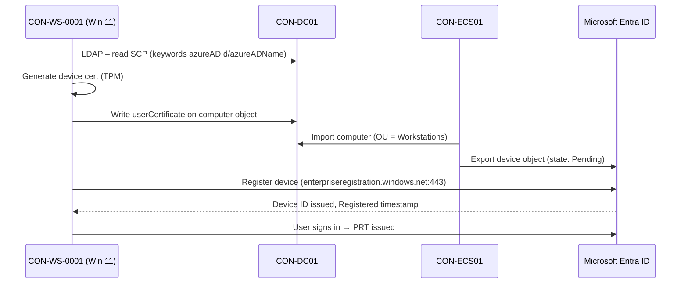

# 04 – Hybrid Microsoft Entra Join

> Part of the [Entra Connect playbook](../README.md). Related: [05 Intune](../05-Integrate-with-Intune/README.md) · [07 Device sync & CA](../07-Device-Synchronization/README.md) · [08 Seamless SSO](../08-Seamless-SSO/README.md) · [10 Cloud migration](../10-Support-Cloud-Migration/README.md)

## Overview

**Microsoft Entra hybrid join** (formerly *Hybrid Azure AD Join*) registers an existing AD domain-joined Windows device in Microsoft Entra ID. The device keeps its on-premises join (GPO, Kerberos, file shares) and also gets a cloud device identity. That identity enables:

- **Primary Refresh Token (PRT)**: SSO to Entra-protected apps from Windows sign-in
- **Conditional Access** device grant control *Require Microsoft Entra hybrid joined device* ([07](../07-Device-Synchronization/README.md))
- **Intune auto-enrollment** via GPO and co-management ([05](../05-Integrate-with-Intune/README.md))
- **Windows Hello for Business** hybrid deployments and BitLocker key escrow to Entra ID

| | Entra registered | **Entra hybrid joined** | Entra joined |
|---|---|---|---|
| Device owner | Personal / BYOD | Corporate | Corporate |
| AD domain join | No | **Yes** | No |
| Sign-in account | Local/MSA + work account added | AD account | Entra account |
| Management | Intune MAM/MDM | GPO + ConfigMgr/Intune | Intune |
| Needs line of sight to DC | No | For join and user sign-in | No (cloud Kerberos for on-premises resources) |
| Typical use | BYOD | **Existing estate during transition** | New/rebuilt devices, the cloud-native target |

> [!TIP]
> Microsoft's guidance for **new** devices is Entra join + Intune (Autopilot). Use hybrid join for the existing fleet and as a bridge, then refresh devices to Entra join ([10](../10-Support-Cloud-Migration/README.md)). Don't build *new* Autopilot hybrid join deployments without a hard dependency.

## How It Works (Architecture)

**Service Connection Point (SCP):** Entra Connect writes an SCP in the AD configuration partition:

`CN=62a0ff2e-97b9-4513-943f-0d221bd30080,CN=Device Registration Configuration,CN=Services,CN=Configuration,DC=contoso,DC=local`

Its `keywords` attribute holds `azureADName:contoso.com` and `azureADId:<tenant GUID>`. Windows devices read it to discover which tenant to join.

**Registration flow (managed domain):**

1. At computer startup or user sign-in, the scheduled task **`\Microsoft\Windows\Workplace Join\Automatic-Device-Join`** runs `dsregcmd`.
2. The device reads the SCP from AD (or from the registry for targeted rollout).
3. The device creates a self-signed certificate and writes its public key to its own AD `userCertificate` attribute.
4. Entra Connect syncs the computer object (scoped by OU) to Entra ID. It appears as *Microsoft Entra hybrid joined* with **Registered = Pending**.
5. On the next user sign-in, the device completes registration with Entra ID using the certificate. Registered then shows a date.
6. The user's sign-in obtains a **PRT**.

**Federated flow:** the device authenticates to AD FS via WS-Trust (`/adfs/services/trust/2005/windowstransport` and `/13/windowstransport`, intranet only), and registration completes immediately, without waiting for sync. Microsoft recommends the managed flow even when AD FS exists.



**Endpoints the device must reach (user/SYSTEM context, through the proxy):** `https://enterpriseregistration.windows.net`, `https://login.microsoftonline.com`, `https://device.login.microsoftonline.com`, and `https://autologon.microsoftazuread-sso.com` if Seamless SSO is used. The SYSTEM context needs WPAD or WinHTTP proxy settings, because a user-only PAC file is not enough.

**dsregcmd /status key fields:**

| Field | Healthy hybrid value | Meaning |
|---|---|---|
| `AzureAdJoined` | YES | Device registered in Entra |
| `DomainJoined` | YES | Joined to AD |
| `DomainName` | CONTOSO | AD domain |
| `DeviceAuthStatus` | SUCCESS | Device can authenticate to Entra |
| `AzureAdPrt` | YES | User has a PRT (run as the user) |
| `TenantName` / `TenantId` | contoso.com / GUID | Joined to the correct tenant |
| `WorkplaceJoined` | NO | No extra Entra registered state |

> [!NOTE]
> A **preview** lets Windows 11 (build 26100.6584+) hybrid join through **Microsoft Entra Kerberos**, using Windows Server 2025 DCs, without waiting for the sync cycle. It is preview only. Production designs below use the classic sync-based flow.

## Prerequisites

| Area | Requirement |
|---|---|
| Licensing | Entra ID Free for join. P1 for CA that requires a hybrid joined device. |
| OS | Windows 10 1607+ / Windows 11, Windows Server 2016+. Use current supported builds. |
| Entra Connect | Computer objects' OUs **in sync scope** ([01](../01-Synchronize-Users-to-Microsoft-365/README.md)) |
| SCP creation | **Enterprise Admin** credentials (configuration partition) in the wizard |
| Entra roles | Hybrid Identity Administrator for the wizard. **Devices > Device settings**: *Users may join devices to Microsoft Entra* does **not** affect hybrid join. |
| Device quota | *Maximum number of devices per user* doesn't apply to hybrid joined devices |
| Network | Outbound 443 to the endpoints above, from the **computer (SYSTEM) context** |
| Downlevel | Windows 7/8.1 are out of support. Not covered. |
| Block Entra registered state | Set `HKLM\SOFTWARE\Policies\Microsoft\Windows\WorkplaceJoin\BlockAADWorkplaceJoin = 1` (DWORD) to stop users adding work accounts that create a dual state |

## Step-by-Step Workflow

1. **Put workstation OUs in scope**: run the Entra Connect wizard > **Configure > Customize synchronization options > Domain and OU filtering**. Tick `Corp/Workstations/Pilot` (pilot) and later `Corp/Workstations/Production`.
2. **Configure hybrid join**: open the wizard > **Configure > Configure device options > Next** and sign in as Hybrid Identity Administrator.
   1. **Device options**: select *Configure Microsoft Entra hybrid join*.
   2. **Device operating systems**: select *Windows 10 or later domain-joined devices*.
   3. **SCP configuration**: tick the forest `contoso.local`, set Authentication Service = **Microsoft Entra ID**, click **Add** to enter **Enterprise Admin** credentials, then **Next > Configure**.
3. **Targeted rollout (recommended for 5,000 devices)**
   1. On `CON-DC01`, open **ADSI Edit > Connect to > Configuration**.
   2. Browse to `CN=Services > CN=Device Registration Configuration > CN=62a0ff2e-…` and **clear** the `keywords` values. Record them first.
   3. **Group Policy Management > Corp/Workstations/Pilot > Create GPO** `CON-Pilot-HybridJoin`. Then **Computer Configuration > Preferences > Windows Settings > Registry > New > Registry Item**:
      - `HKLM\SOFTWARE\Microsoft\Windows\CurrentVersion\CDJ\AAD`, `TenantId` (REG_SZ) = tenant GUID
      - `HKLM\SOFTWARE\Microsoft\Windows\CurrentVersion\CDJ\AAD`, `TenantName` (REG_SZ) = `contoso.com` (managed) or the federated domain
   4. After the pilot, restore the SCP keywords and delete the GPO (the registry keys must be removed too, so set the GPP action to *Delete* first).
4. **Block dual state**: in the same or a separate GPO, set the `BlockAADWorkplaceJoin` registry value = 1.
5. **Trigger**: on a pilot device run `gpupdate /force`, then sign out and in (or restart). The scheduled task runs at user sign-in.
6. **Wait for sync**: up to 30 minutes, or `Start-ADSyncSyncCycle -PolicyType Delta`, then sign out and in again so registration completes.
7. **Verify**: **Entra admin center > Entra ID > Devices > All devices**. Filter *Join type = Microsoft Entra hybrid joined*. *Registered* must show a date, not *Pending*.

## PowerShell / CLI Reference

```powershell
# On the device: full join, SSO and diagnostics state
dsregcmd /status

# On the device: run the hybrid join pre-check and attempt join with verbose output (admin, SYSTEM-like)
dsregcmd /debug /join   # use only during troubleshooting; prefer letting the scheduled task run

# On the device: leave Entra (keeps AD join) - useful to reset a broken state
dsregcmd /leave

# On the device: start the join task immediately
Start-ScheduledTask -TaskPath "\Microsoft\Windows\Workplace Join\" -TaskName "Automatic-Device-Join"

# On a DC: read the SCP keywords
$scp = "CN=62a0ff2e-97b9-4513-943f-0d221bd30080,CN=Device Registration Configuration,CN=Services," + (Get-ADRootDSE).configurationNamingContext
Get-ADObject $scp -Properties keywords | Select-Object -ExpandProperty keywords

# On a DC: confirm a computer has a userCertificate (required before sync shows the device)
Get-ADComputer CON-WS-0001 -Properties userCertificate | Select-Object Name, @{n='Certs';e={$_.userCertificate.Count}}

# On the Connect server: push computer objects now
Start-ADSyncSyncCycle -PolicyType Delta
```

```powershell
# Microsoft Graph: list hybrid joined devices and their registration state
Connect-MgGraph -Scopes "Device.Read.All"
Get-MgDevice -All -Filter "trustType eq 'ServerAd'" -Property DisplayName,TrustType,RegistrationDateTime,ApproximateLastSignInDateTime,OperatingSystemVersion |
  Select-Object DisplayName, RegistrationDateTime, ApproximateLastSignInDateTime   # RegistrationDateTime empty = still Pending

# Count pending (synced but not yet registered) devices
(Get-MgDevice -All -Filter "trustType eq 'ServerAd'" -Property RegistrationDateTime | Where-Object { -not $_.RegistrationDateTime }).Count
```

## Enterprise Lab

### Scenario

Contoso Healthcare has about 3,800 domain-joined Windows 11 workstations across all sites. Before it can require compliant or hybrid joined devices for the EHR portal, every corporate workstation needs an Entra device identity. A clinic pilot of 50 devices comes first, using targeted rollout so hospital wards are unaffected.

### Lab Environment

Use the [shared lab](../README.md#shared-lab-environment--contoso-healthcare): `CON-DC01`, `CON-ECS01`, `Corp/Workstations/Pilot` and `Production`, `CON-WS-0001..0003` (Windows 11 Enterprise), and the user `alex.wilber`.

### Objectives

1. Pilot devices show **Microsoft Entra hybrid joined** with a Registered date within 1 hour of first sign-in.
2. `dsregcmd /status` on pilot devices shows `AzureAdJoined : YES`, `DeviceAuthStatus : SUCCESS` and `AzureAdPrt : YES`.
3. Production OU devices **do not** join during the pilot (targeted rollout proven).
4. No device ends up in a dual (registered + hybrid) state.

### Lab Tasks

| # | Task | Steps | Expected result |
|---|---|---|---|
| 1 | Scope OUs | Workflow step 1 (`Pilot` + `Production` in scope) | Computer objects import to the connector space |
| 2 | Configure SCP | Workflow step 2 | SCP object exists with keywords |
| 3 | Switch to targeted rollout | Clear SCP keywords, deploy the CDJ\AAD GPO to `Pilot` | Pilot devices have the registry values. Production devices don't. |
| 4 | Block dual state | GPO `BlockAADWorkplaceJoin=1` on Workstations | Registry value present |
| 5 | Join pilot | Move `CON-WS-0001/0002` to `Pilot`, restart, sign in as alex.wilber | userCertificate populated, device *Pending* in Entra |
| 6 | Complete join | Delta sync, sign out/in | Registered timestamp set, PRT = YES |
| 7 | Negative test | Keep `CON-WS-0003` in `Production`, restart | `AzureAdJoined : NO` |

### Validation

- **Portal**: **Entra admin center > Devices > All devices**: pilot devices show Join type *Microsoft Entra hybrid joined* and Registered = date.
- **Sync logs**: **Synchronization Service Manager > Connectors > contoso.local > Search Connector Space**. The computer object exports to the Entra connector. If `userCertificate` is missing, it is filtered by the sync rule *In from AD – Computer Join*.
- **Device**: `dsregcmd /status` (fields above). **Event Viewer > Applications and Services Logs > Microsoft > Windows > User Device Registration > Admin**: event **304/305** on failure, success events otherwise.
- **Audit logs**: **Entra > Monitoring & health > Audit logs**, Category *Device*, Activity *Register device*.
- **Sign-in logs**: alex.wilber's sign-in shows *Device info > Join type: Microsoft Entra hybrid joined, Compliant/Managed* columns.

### Break/Fix Exercise

| | |
|---|---|
| **Failure** | Remove `Corp/Workstations/Pilot` from Entra Connect OU filtering after the device registered. |
| **Symptoms** | After the next sync, the device object is **deleted** in Entra. `dsregcmd /status` still says `AzureAdJoined : YES`, but `DeviceAuthStatus : FAILED. Device is either disabled or deleted`. CA "require hybrid joined" blocks the user. |
| **Diagnosis** | Audit log *Delete device* by the sync account. The OU no longer appears in `ContainerInclusionList`. |
| **Fix** | Re-add the OU to scope and run a full sync. On the device, run `dsregcmd /leave` (elevated), then restart and sign in to re-register (the device object is new; Intune may need re-enrollment). |

### Cleanup/Rollback

- **Pilot rollback**: delete the CDJ\AAD registry items (GPP action *Delete*), then on devices run `dsregcmd /leave`. Remove the OU from sync scope to delete device objects.
- **Full rollback**: in the wizard **Configure device options > Configure SCP** remove the forest, or delete the SCP in ADSI Edit.

> [!WARNING]
> Removing hybrid join breaks CA policies that require hybrid joined devices and Intune GPO enrollment ([05](../05-Integrate-with-Intune/README.md)). Disable those policies first.

## Troubleshooting

| Symptom | Cause | Resolution |
|---|---|---|
| Device stays *Pending* | User hasn't signed in since sync, or registration blocked by proxy | Sign out/in after sync. Check WinHTTP proxy for SYSTEM: `netsh winhttp show proxy`. |
| `DsrCmdAccountNotFoundError` / device not in Entra | Computer OU out of scope, or no `userCertificate` | Add the OU. Check that the device wrote the cert (task ran?). |
| `AzureAdJoined : NO`, event 204/304 | SCP missing or wrong tenant, DC unreachable | Read SCP keywords. `nltest /dsgetdc:contoso.local`. |
| Device joined to wrong tenant | Stale CDJ\AAD registry or old SCP | Fix the keyword/registry values, `dsregcmd /leave`, rejoin |
| Dual state (registered + hybrid) | User added work account before hybrid join | Windows 10 1803+ auto-cleans registered state on hybrid join. Deploy `BlockAADWorkplaceJoin`. |
| `AzureAdPrt : NO` | Password changed while off-network, ADFS/WS-Trust failure (federated), clock skew | Lock/unlock on network. Check User Device Registration and AAD Operational logs. |
| `0x801c03f2` | Device public key not found (cert not synced yet) | Wait for sync, then sign out/in |

**Logs:** *Applications and Services Logs > Microsoft > Windows > User Device Registration > Admin*, *…> AAD > Operational*. `dsregcmd /status` *Diagnostic Data* section (`Client ErrorCode`, `Server ErrorCode`, `Attempt Status`).

## Security & Best Practices

- **Use TPM-backed device keys.** `dsregcmd /status` should show `TpmProtected : YES`. Require TPM 2.0 in hardware standards.
- **Least privilege:** Enterprise Admin is needed only once for the SCP. Use a just-in-time elevation and remove it afterwards.
- **Targeted rollout** reduces blast radius. Keep the SCP empty until the pilot passes.
- **Clean stale devices** quarterly: disable devices with `ApproximateLastSignInDateTime` older than 90 days, then delete after 30 more days. Delete in AD first, so sync removes them from Entra.
- **Zero Trust:** a hybrid join proves *corporate ownership*, not *health*. Pair it with Intune compliance ([05](../05-Integrate-with-Intune/README.md), [07](../07-Device-Synchronization/README.md)).
- Keep `CON-ECS01` (which syncs device objects) in **Tier 0**.

## Interview / Exam Notes

- The SCP lives in the **configuration partition** under *Device Registration Configuration*. It needs **Enterprise Admin** to create.
- Targeted rollout: clear the SCP and deploy `HKLM\SOFTWARE\Microsoft\Windows\CurrentVersion\CDJ\AAD` `TenantId` + `TenantName` via GPO.
- **Managed flow** requires Entra Connect to sync the computer object (`userCertificate`) before registration completes. **Federated flow** completes via AD FS WS-Trust immediately.
- `dsregcmd /status`: `AzureAdJoined=YES` + `DomainJoined=YES` = hybrid joined. `AzureAdPrt=YES` = SSO works.
- The scheduled task is **Automatic-Device-Join** under `\Microsoft\Windows\Workplace Join`.
- Device registration traffic runs in **SYSTEM context**, so configure a WinHTTP/WPAD proxy.
- Microsoft recommends **Entra join** for new devices. Hybrid join is a transition state.

## References

- [Plan your Microsoft Entra hybrid join implementation](https://learn.microsoft.com/entra/identity/devices/hybrid-join-plan)
- [Configure Microsoft Entra hybrid join](https://learn.microsoft.com/entra/identity/devices/how-to-hybrid-join)
- [Microsoft Entra hybrid join targeted deployment](https://learn.microsoft.com/entra/identity/devices/hybrid-join-control)
- [Manual configuration / SCP details](https://learn.microsoft.com/entra/identity/devices/hybrid-join-manual)
- [Troubleshoot devices using dsregcmd](https://learn.microsoft.com/entra/identity/devices/troubleshoot-device-dsregcmd)
- [Troubleshoot Microsoft Entra hybrid joined devices](https://learn.microsoft.com/entra/identity/devices/troubleshoot-hybrid-join-windows-current)
- [How it works: Device registration](https://learn.microsoft.com/entra/identity/devices/device-registration-how-it-works)
- [Manage stale devices](https://learn.microsoft.com/entra/identity/devices/manage-stale-devices)
