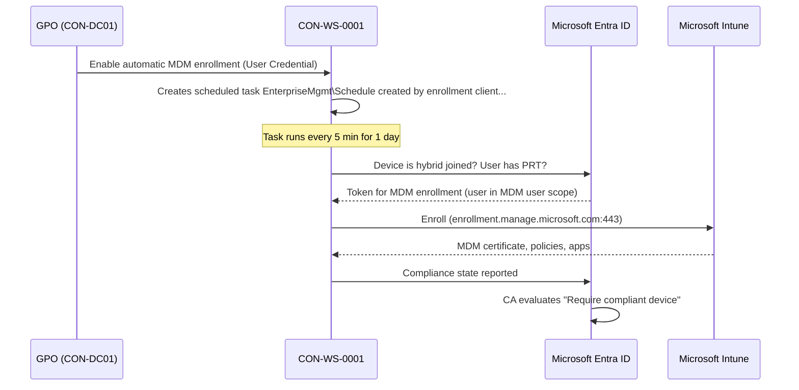

# 05 – Integrate with Intune

> Part of the [Entra Connect playbook](../README.md). Related: [04 Hybrid Join](../04-Hybrid-Microsoft-Entra-Join/README.md) · [06 Groups](../06-Synchronize-Groups/README.md) · [07 Device sync & CA](../07-Device-Synchronization/README.md) · [10 Cloud migration](../10-Support-Cloud-Migration/README.md)

## Overview

Entra Connect doesn't talk to Intune directly. It supplies the **identities Intune depends on**:

- **Synced users** (with licenses) who are in the **MDM user scope**
- **Hybrid joined devices** ([04](../04-Hybrid-Microsoft-Entra-Join/README.md)) that can auto-enroll with the user's Entra credentials
- **Synced groups** ([06](../06-Synchronize-Groups/README.md)) used to target Intune policies and apps

Once enrolled, the device reports **compliance** to Entra ID, which Conditional Access consumes ([07](../07-Device-Synchronization/README.md)).

Ways to bring existing domain-joined devices into Intune:

| Method | How | Best for |
|---|---|---|
| **GPO auto-enrollment** | *Enable automatic MDM enrollment using default Microsoft Entra credentials* | Estates with no Configuration Manager, managed by GPO today |
| **Co-management** (ConfigMgr) | ConfigMgr client enrolls the device and workloads shift to Intune per slider | Estates with ConfigMgr, gradual workload moves |
| **Tenant attach** | ConfigMgr devices uploaded to Intune admin center (no MDM enrollment) | Visibility + remote actions only |
| **Autopilot (Entra join)** | Reimage/reset into Entra join + Intune | Target state for refreshed devices ([10](../10-Support-Cloud-Migration/README.md)) |

**Co-management basics:** a device is managed by ConfigMgr and Intune at once. Each workload has a slider: Compliance policies, Windows Update policies, Resource access, Endpoint Protection, Device configuration, Office Click-to-Run, and Client apps. Each slider can be set to *Configuration Manager*, *Pilot Intune* (collection-scoped), or *Intune*. Prerequisites: ConfigMgr current branch, hybrid joined (or Entra joined) devices, and Intune licenses.

## How It Works (Architecture)



**Components:**

| Component | Detail |
|---|---|
| GPO setting | **Computer Configuration > Policies > Administrative Templates > Windows Components > MDM > Enable automatic MDM enrollment using default Microsoft Entra credentials** |
| Credential type | **User Credential** (default; enrolls as the signed-in user). **Device Credential** is only for co-management or Azure Virtual Desktop multi-session. |
| Scheduled task | `\Microsoft\Windows\EnterpriseMgmt\Schedule created by enrollment client for automatically enrolling in MDM from Microsoft Entra ID`. It runs every 5 minutes for 1 day. |
| MDM user scope | **Intune admin center > Devices > Enrollment > Windows > Automatic Enrollment**: *Some* (group) or *All* |
| MDM URLs | Discovery `https://enrollment.manage.microsoft.com/enrollmentserver/discovery.svc`, terms of use `https://portal.manage.microsoft.com/TermsofUse.aspx`, compliance `https://portal.manage.microsoft.com/?portalAction=Compliance` |
| Network | Device → `*.manage.microsoft.com`, `enterpriseregistration.windows.net`, `login.microsoftonline.com` on 443 |

**Conflict handling:** while a device stays domain-joined, **Group Policy wins over MDM** for the same setting by default. From Windows 10 1803, the **ControlPolicyConflict/MDMWinsOverGP** policy (Settings catalog) makes MDM win for policies backed by Policy CSP. Plan to remove overlapping GPOs as settings move to Intune.

> [!NOTE]
> Since the Microsoft Entra rename, the GPO setting text in current ADMX templates reads "…default **Microsoft Entra** credentials". Older central stores still show "…default Azure AD credentials". It is the same policy.

## Prerequisites

| Area | Requirement |
|---|---|
| Licensing | **Intune Plan 1** per user (included in M365 E3/E5, EMS E3/E5) + Entra ID P1 (for automatic enrollment and CA) |
| Device identity | Device **hybrid joined** ([04](../04-Hybrid-Microsoft-Entra-Join/README.md)). `dsregcmd /status` shows `AzureAdJoined : YES` and `AzureAdPrt : YES`. |
| OS | Windows 10 1709+ (Pro, Enterprise, Education). Lab uses Windows 11 Enterprise. |
| User | Synced, licensed for Intune, **member of MDM user scope group**, signed in with the AD account |
| Intune | MDM authority = Intune (default for new tenants). Windows enrollment not blocked by **Devices > Enrollment > Device platform restriction** (Windows MDM allowed, personally owned setting as required). |
| GPO | ADMX version that includes the MDM node (Windows 10 1803+ templates, ideally the latest Windows 11 ADMX in the central store) |
| Roles | Intune Administrator (or Policy and Profile Manager) for enrollment settings. Group Policy Creator Owners / delegated OU rights for GPO. |
| Device limit | **Devices > Enrollment > Device limit restrictions**: check the per-user limit (default 5) for shared-workstation users |

## Step-by-Step Workflow

1. **Confirm hybrid join** on pilot devices ([04](../04-Hybrid-Microsoft-Entra-Join/README.md)). Don't continue until `AzureAdPrt : YES`.
2. **Create the pilot group** `GRP-Pilot-Users` in AD (`Corp/Groups`) and sync it ([06](../06-Synchronize-Groups/README.md)).
3. **Set the MDM user scope**
   1. **Intune admin center > Devices > Enrollment > Windows > Automatic Enrollment** (on some tenants: **Entra admin center > Mobility (MDM and WIP) > Microsoft Intune**).
   2. **MDM user scope** = *Some* > select `GRP-Pilot-Users`. Leave the default MDM URLs.
   3. **MAM user scope** = *None* for corporate Windows (prevents MAM-WE registration taking precedence).
4. **Check restrictions**: **Devices > Enrollment > Device platform restriction > Windows restrictions**: *Windows (MDM)* = Allow.
5. **Create the GPO**
   1. **Group Policy Management > Corp/Workstations/Pilot > Create a GPO** `CON-Pilot-IntuneEnroll`.
   2. **Computer Configuration > Policies > Administrative Templates > Windows Components > MDM > Enable automatic MDM enrollment using default Microsoft Entra credentials** = **Enabled**, *Select Credential Type to Use* = **User Credential**.
6. **Apply**: on the device, run `gpupdate /force`. The enrollment task is created. Sign out/in as a scoped user, or wait up to 5 minutes.
7. **Create a baseline compliance policy**: **Intune admin center > Devices > Compliance > Create policy > Windows 10 and later**. Require BitLocker, Secure Boot, Code integrity, Firewall, Defender Antimalware, Minimum OS 10.0.22631. Assign to `GRP-Pilot-Devices` or users.
8. **Mark noncompliant after**: **Devices > Compliance > Compliance settings > Mark devices with no compliance policy assigned as** = *Not compliant* (once all devices are targeted).
9. **Verify enrollment** (Validation section) and then expand GPO links to `Production` in waves.
10. *(Co-management alternative)*: **ConfigMgr console > Administration > Cloud Services > Cloud Attach > Configure Cloud Attach**. Enable automatic enrollment *Pilot* collection, then move workload sliders gradually.

## PowerShell / CLI Reference

```powershell
# Device: confirm hybrid join and PRT before enrollment
dsregcmd /status | Select-String "AzureAdJoined|DomainJoined|AzureAdPrt|MdmUrl"   # MdmUrl populated when user is in MDM scope

# Device: confirm the auto-enrollment GPO has applied (should be 1 = enabled)
Get-ItemProperty "HKLM:\SOFTWARE\Policies\Microsoft\Windows\CurrentVersion\MDM" -ErrorAction SilentlyContinue |
  Select-Object AutoEnrollMDM, UseAADCredentialType      # UseAADCredentialType 1 = User, 2 = Device

# Device: show the enrollment scheduled task and its last result
Get-ScheduledTask -TaskPath "\Microsoft\Windows\EnterpriseMgmt\*" | Get-ScheduledTaskInfo |
  Select-Object TaskName, LastRunTime, LastTaskResult

# Device: list MDM enrollments (ProviderID MS DM Server = Intune)
Get-ChildItem HKLM:\SOFTWARE\Microsoft\Enrollments | ForEach-Object { Get-ItemProperty $_.PSPath } |
  Where-Object ProviderID -eq "MS DM Server" | Select-Object PSChildName, UPN, EnrollmentState

# Device: generate an MDM diagnostic report (HTML + CAB) for support
mdmdiagnosticstool.exe -area "DeviceEnrollment;DeviceProvisioning;Autopilot" -cab C:\Temp\mdmdiag.cab

# Device: force an Intune check-in (Intune Management Extension sync for Win32 apps/scripts)
Start-Process "intunemanagementextension://syncapp"
```

```powershell
# Microsoft Graph: list Intune-managed Windows devices that are hybrid joined, with compliance
Connect-MgGraph -Scopes "DeviceManagementManagedDevices.Read.All"
Get-MgDeviceManagementManagedDevice -All -Filter "operatingSystem eq 'Windows'" |
  Select-Object DeviceName, UserPrincipalName, JoinType, ComplianceState, ManagementAgent, LastSyncDateTime

# Microsoft Graph: trigger a device sync from the service side
Sync-MgDeviceManagementManagedDevice -ManagedDeviceId <managedDeviceId>
```

## Enterprise Lab

### Scenario

Contoso Healthcare has no Configuration Manager. Workstations are managed by about 120 GPOs. The security team needs BitLocker and Defender compliance reporting, and CA must block non-compliant devices from the EHR portal. Phase 1 enrolls 50 clinic workstations in the Pilot OU via GPO auto-enrollment.

### Lab Environment

Use the [shared lab](../README.md#shared-lab-environment--contoso-healthcare): `CON-DC01`, `CON-ECS01`, `Corp/Workstations/Pilot`, `CON-WS-0001/0002` (hybrid joined, from [04](../04-Hybrid-Microsoft-Entra-Join/README.md)), `GRP-Pilot-Users`, `GRP-Pilot-Devices`, and the user `alex.wilber`.

### Objectives

1. 100% of pilot devices appear in Intune with **Join type = Hybrid Azure AD joined** and **Managed by = Intune** within 1 hour of GPO application.
2. Users **outside** the MDM scope don't enroll (scope enforced).
3. A Windows compliance policy evaluates and reports *Compliant* on ≥ 1 device and *Not compliant* on a deliberately broken device.
4. The enrollment task's last result is `0x0` on all pilot devices.

### Lab Tasks

| # | Task | Steps | Expected result |
|---|---|---|---|
| 1 | Set MDM scope | Workflow step 3 (`GRP-Pilot-Users`) | Scope = Some |
| 2 | Create GPO | Workflow step 5, linked to `Pilot` only | GPO applied (`gpresult /r` lists it) |
| 3 | Enroll in-scope user | Sign in to `CON-WS-0001` as alex.wilber | Device listed under **Devices > Windows** within ~15 min |
| 4 | Negative test | Sign in to `CON-WS-0002` as a user **not** in `GRP-Pilot-Users` | No enrollment. `MdmUrl` empty in `dsregcmd /status`. |
| 5 | Compliance policy | Workflow step 7 | Policy shows *Succeeded* on device |
| 6 | Break compliance | On `CON-WS-0002` (after enrolling an in-scope user), suspend BitLocker (`Suspend-BitLocker -MountPoint C: -RebootCount 0`) | Device becomes *Not compliant* after check-in |
| 7 | Settings conflict check | Create an Intune Settings catalog policy that overlaps an existing GPO (e.g. screen lock) | GPO value wins (no MDMWinsOverGP), as documented |

### Validation

- **Intune portal**: **Devices > Windows > Windows devices**: *Managed by* Intune, *Join type* Hybrid Azure AD joined, *Compliance* state. **Devices > Monitor > Enrollment failures** shows nothing for pilot users.
- **Entra portal**: **Devices > All devices**: the same device shows *MDM = Microsoft Intune*, *Compliant = Yes*.
- **Device**: **Settings > Accounts > Access work or school > (connected account) > Info**: *Managed by Contoso*, last sync time, **Sync** button works.
- **Event log**: *Applications and Services Logs > Microsoft > Windows > DeviceManagement-Enterprise-Diagnostics-Provider > Admin*: event **75** (auto-enrollment succeeded) or **76** (failed, with error code).
- **Entra Connect**: the user and device both have `OnPremisesSyncEnabled = True`.
- **Sign-in logs**: device details show *Managed: Yes, Compliant: Yes*.

### Break/Fix Exercise

| | |
|---|---|
| **Failure** | Set MDM user scope to *None*, then re-run the enrollment task on a new pilot device. |
| **Symptoms** | Device never appears in Intune. The enrollment task finishes without enrolling, and `dsregcmd /status` shows `MdmUrl` empty (no MDM URLs are issued to users out of scope). |
| **Diagnosis** | Event 76 code. The MDM user scope page shows None. `dsregcmd` confirms join and PRT are fine (so the problem is not identity). |
| **Fix** | Set scope back to *Some > GRP-Pilot-Users*. Sign out/in (the PRT refresh brings the MDM URLs), or run the EnterpriseMgmt task. Event 75 follows. |

> [!TIP]
> `0x80180026` specifically means MDM enrollment is **blocked on the device**, often because the ConfigMgr client is installed with co-management disabled or because of a "Disable MDM enrollment" policy. `0x8018002b` usually means the UPN is unverified (`.local`) or the user isn't licensed. Always read the code before assuming scope.

### Cleanup/Rollback

- Unlink the GPO. Already enrolled devices stay enrolled.
- To unenroll: **Intune > Devices > (device) > Retire**, which removes company data and the MDM profile. Or on the device, **Access work or school > Disconnect** (MDM only, not hybrid join).
- Revert the MDM user scope to the previous value. Delete the test compliance policy.

## Troubleshooting

| Symptom | Cause | Resolution |
|---|---|---|
| Event 76 `0x80180026` | MDM enrollment disabled on device / ConfigMgr agent conflict | Remove the "Disable MDM enrollment" policy. Use co-management instead of GPO with ConfigMgr. |
| Event 76 `0x8018002b` | UPN not routable/verified, or user not licensed | Fix UPN ([02](../02-Single-Identity-Same-Username-Password/README.md)) and assign an Intune license |
| Event 76, device already enrolled | Stale enrollment from another MDM / previous tenant | Unenroll the old MDM (Access work or school > Disconnect), then retry |
| Task not present | GPO not applied / old ADMX | `gpresult /h`, update the central store ADMX |
| Device enrolled but Join type shows *Microsoft Entra registered* | Enrolled before hybrid join completed | Retire, ensure `AzureAdJoined : YES`, re-enroll |
| Settings not applying | GPO conflict (GP wins by default) | Remove the overlapping GPO or use MDMWinsOverGP |
| Device limit reached | Shared-workstation user hit the per-user limit | Raise the limit, enroll shared PCs with Device Credential via co-management, or clean stale devices |

**Logs:** `DeviceManagement-Enterprise-Diagnostics-Provider/Admin` (75/76), `User Device Registration/Admin`, `%ProgramData%\Microsoft\IntuneManagementExtension\Logs\IntuneManagementExtension.log`, and the `mdmdiagnosticstool` output.

## Security & Best Practices

- **Scope by group** (*Some*) and expand in waves. *All* is fine once stable.
- **Least privilege in Intune:** use **Intune RBAC** with scope tags per site (Seattle, Portland, Spokane), not Intune Administrator for everyone.
- **Compliance + CA** is the enforcement point. Enrollment alone protects nothing. Set *Mark devices with no compliance policy assigned* to *Not compliant*.
- Remove duplicate GPOs as settings migrate to avoid GP/MDM drift, and document the authoritative source per setting.
- **Protect Intune admin accounts** (cloud-only, phishing-resistant MFA, PIM) and enable **multi-admin approval** for wipe and script actions.
- **Zero Trust:** "verify explicitly" means the device must be **known (hybrid join) + healthy (compliant)** before it can access data ([07](../07-Device-Synchronization/README.md)).

## Interview / Exam Notes

- GPO path: **Computer Configuration > Administrative Templates > Windows Components > MDM > Enable automatic MDM enrollment using default Microsoft Entra credentials**.
- **User Credential** for standard devices. **Device Credential** for co-management or AVD multi-session.
- Automatic enrollment needs **Entra ID P1** + the **MDM user scope** (Some/All). Users outside scope don't enroll.
- The enrollment task runs **every 5 minutes for 1 day** under `\Microsoft\Windows\EnterpriseMgmt`.
- Events **75** (success) / **76** (failure) in *DeviceManagement-Enterprise-Diagnostics-Provider/Admin*.
- Group Policy wins over MDM unless **MDMWinsOverGP** is configured.
- Co-management workloads: Compliance, Windows Update, Resource access, Endpoint Protection, Device configuration, Office C2R, Client apps.

## References

- [Enroll a Windows device automatically using Group Policy](https://learn.microsoft.com/windows/client-management/enroll-a-windows-10-device-automatically-using-group-policy)
- [Set up automatic enrollment for Windows devices](https://learn.microsoft.com/intune/intune-service/enrollment/windows-enroll)
- [What is co-management?](https://learn.microsoft.com/intune/configmgr/comanage/overview)
- [Co-management workloads](https://learn.microsoft.com/intune/configmgr/comanage/workloads)
- [Create a compliance policy in Intune](https://learn.microsoft.com/intune/intune-service/protect/create-compliance-policy)
- [Troubleshoot Windows device enrollment errors](https://learn.microsoft.com/troubleshoot/mem/intune/device-enrollment/troubleshoot-windows-enrollment-errors)
- [Policy CSP – ControlPolicyConflict](https://learn.microsoft.com/windows/client-management/mdm/policy-csp-controlpolicyconflict)
