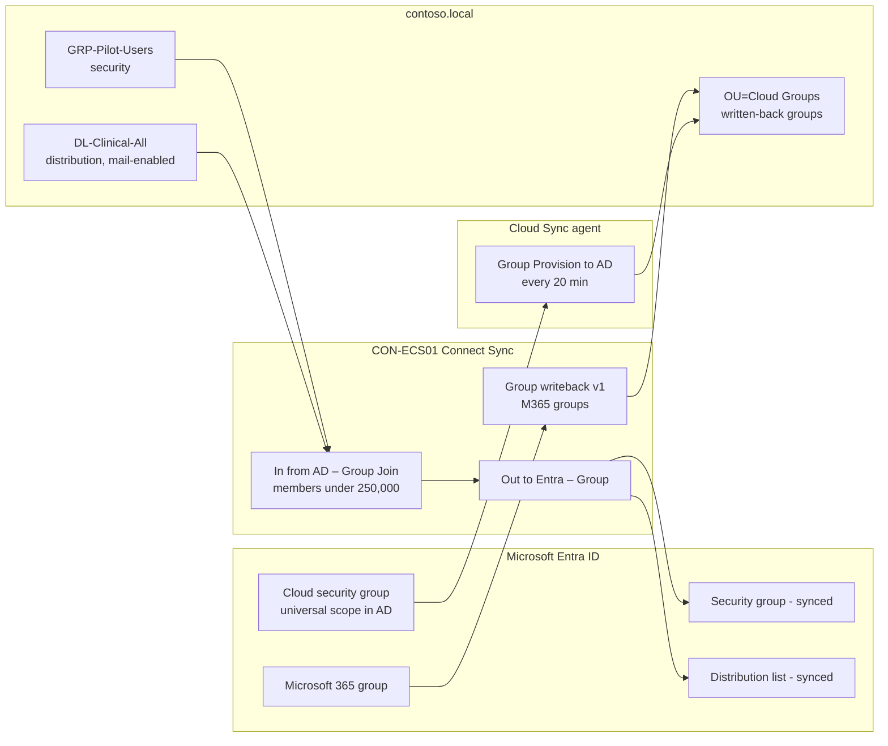

# 06 – Synchronize Groups

> Part of the [Entra Connect playbook](../README.md). Related: [01 Sync users](../01-Synchronize-Users-to-Microsoft-365/README.md) · [05 Intune](../05-Integrate-with-Intune/README.md) · [07 Device sync & CA](../07-Device-Synchronization/README.md) · [10 Cloud migration](../10-Support-Cloud-Migration/README.md)

## Overview

Groups are how hybrid organizations assign licenses, target Intune policies, scope Conditional Access, and grant access to SharePoint, Teams, and apps. Entra Connect syncs AD groups **one way (AD → Entra ID)**, and those groups are read-only in the cloud. Separate **writeback** features handle cloud → AD.

| AD group type | Synced to Entra ID as | Usable for |
|---|---|---|
| Security group (global/universal/domain local) | Security group (`securityEnabled=true`) | Licensing, CA, Intune, app assignment, SharePoint permissions |
| Mail-enabled security group | Mail-enabled security group | All of the above + Exchange Online mail and permissions |
| Distribution group | Distribution list (**must be mail-enabled** to sync) | Exchange Online mail only. Not for CA, licensing, or Intune. |
| Group with > 250,000 members | **Not synced** | Split the group |
| Built-in/critical groups (`isCriticalSystemObject`) | **Not synced** | – |

Writeback (cloud → AD) options today:

| Scenario | Tool | Status |
|---|---|---|
| **Microsoft 365 groups** → AD as distribution groups (for Exchange hybrid mail flow to on-premises mailboxes) | Connect Sync **Group writeback v1** | Supported |
| **Cloud security groups** → AD (e.g. for on-premises file share ACLs / Kerberos apps) | **Cloud Sync – Group Provision to AD** | Supported, **recommended** |
| Cloud security groups via Connect Sync | Group writeback **v2** | **Deprecated / retired**. Do not use. |

> [!NOTE]
> **Group writeback v2** in Entra Connect Sync was a preview that ended **June 30, 2024**. Microsoft replaced it with **Group Provision to AD** in **Entra Cloud Sync**, which can run alongside Connect Sync on the same AD. A newer capability converts an AD-synced group's **Source of Authority (SOA)** to Entra ID, so you manage it in the cloud and provision it back to AD. This is the recommended path for retiring on-premises group management ([10](../10-Support-Cloud-Migration/README.md)).

**Nested groups:** Connect Sync syncs nested membership (a group as a member of a group) as-is. Whether a workload *honours* nesting differs:

| Feature | Nested groups supported? |
|---|---|
| Conditional Access user/group scope | **Yes** |
| SSPR scoping, Entra join restriction | Yes |
| Group membership claims in tokens | Yes |
| **Group-based licensing** | **No**. Only direct members get licenses. |
| **App role assignment** (enterprise apps) | **No**. Only direct members. |
| Microsoft 365 groups | **No** (cannot contain groups) |
| Intune assignments | Yes (nested security groups evaluated) |

## How It Works (Architecture)



**Key mechanics:**

- **Scoping:** groups sync if their **OU is in scope** ([01](../01-Synchronize-Users-to-Microsoft-365/README.md)). **Members in out-of-scope OUs are dropped from the cloud membership**, even when the group itself syncs. Membership in Entra ID contains only objects that exist in Entra ID.
- **Size limit:** the default rule *In from AD – Group Join* (and Entra ID itself) blocks groups with **≥ 250,000 members** (v2 endpoint, since Connect 1.6). A group that grows past the limit **stops** syncing until it drops below.
- **Distribution groups** sync only if mail-enabled (`mail`/`proxyAddresses` populated).
- **Group writeback v1** writes Microsoft 365 groups to a chosen OU as **universal distribution groups**. The default rule *Out to AD – Group Writeback Member Limit* caps them at **50,000** members (can be raised to 250,000 by disabling the rule).
- **Cloud Sync Group Provision to AD:** the provisioning job runs every **20 minutes**. It creates groups with **universal** scope, and supports groups up to **50,000 members**. Members must be synced users (matched through `onPremisesObjectIdentifier` = AD `objectGUID`) or other cloud security groups.
- **Disabling writeback** deletes the groups it wrote to AD on the next sync. Enable the **AD Recycle Bin** first.

## Prerequisites

| Area | Requirement |
|---|---|
| Licensing | Group sync: Entra ID Free. **Group-based licensing**, **group writeback** (v1 and Cloud Sync GPAD): **Entra ID P1**. |
| AD | Groups in OUs in sync scope. For writeback, a dedicated OU (e.g. `Corp/Groups/Cloud`) and AD Recycle Bin enabled. |
| Connect version | Current supported build (v2 endpoint default). Group writeback v1 needs the Exchange hybrid schema (`msExch*` attributes) for M365 groups to function in Exchange hybrid. |
| Permissions | Writeback v1: `Set-ADSyncUnifiedGroupWritebackPermissions` on the target OU. Cloud Sync: gMSA permissions via `Set-AADCloudSyncPermissions` or the agent wizard. |
| Cloud Sync agent | Windows Server 2016+, outbound 443, .NET 4.7.1+, agent on a domain-joined server (can be `CON-ECS02` or a separate member server) |
| Roles | Hybrid Identity Administrator (Connect / Cloud Sync config), Groups Administrator / License Administrator (licensing) |
| Exchange | Distribution lists for Exchange Online must be mail-enabled with a valid primary SMTP in a verified domain |

## Step-by-Step Workflow

1. **Design**
   1. Create a dedicated `Corp/Groups` OU and naming standard (`GRP-*` security, `DL-*` distribution, `GRP-Lic-*` licensing).
   2. Flatten groups used for **licensing** and **app assignment** (no nesting).
2. **Scope**: in **Entra Connect wizard > Configure > Customize synchronization options > Domain and OU filtering**, make sure `Corp/Groups` *and* every OU containing members is ticked.
3. **Sync and verify**: `Start-ADSyncSyncCycle -PolicyType Delta`, then **Entra admin center > Entra ID > Groups > All groups**. The *Source* column shows **Windows Server AD**.
4. **Group-based licensing**: **Entra ID > Groups > GRP-Lic-M365E5 > Licenses > + Assignments**, pick Microsoft 365 E5, and toggle service plans as needed.
5. **Microsoft 365 group writeback (v1)** (only if Exchange hybrid needs it)
   1. On `CON-ECS01`: `Set-ADSyncUnifiedGroupWritebackPermissions -ADConnectorAccountName MSOL_xxx -ADConnectorAccountDomain contoso.local -ADObjectDN "OU=Cloud,OU=Groups,OU=Corp,DC=contoso,DC=local"`.
   2. Run the wizard: **Configure > Customize synchronization options > Optional features** and tick **Group writeback**. Select the writeback OU and click **Configure**.
6. **Cloud security groups → AD (Cloud Sync)**
   1. **Entra admin center > Entra ID > Entra Connect > Cloud sync > Agents > Download on-premises agent**, then install it on a member server and sign in as Hybrid Identity Administrator.
   2. **Cloud sync > + New configuration > Microsoft Entra ID to AD sync**, choose `contoso.local`.
   3. **Scope**: *Selected security groups* and add `GRP-Cloud-FileShare-Radiology`. Set **Target container** = `OU=Cloud,OU=Groups,OU=Corp,...`.
   4. **Provision on demand**: select the group and up to 5 members, then **Provision**.
   5. **Enable** the configuration (runs every 20 minutes).
7. **Use it**: in AD, ACL a file share (`\\CON-FS01\Radiology`) with the provisioned universal group.

## PowerShell / CLI Reference

```powershell
# Count members of an AD group, including nested (check against 250K / 50K limits)
(Get-ADGroupMember -Identity "GRP-Pilot-Users" -Recursive).Count

# Find mail-disabled distribution groups that will NOT sync
Get-ADGroup -Filter "GroupCategory -eq 'Distribution'" -SearchBase "OU=Groups,OU=Corp,DC=contoso,DC=local" -Properties mail |
  Where-Object { -not $_.mail } | Select-Object Name, DistinguishedName

# Find nested groups inside licensing groups (nesting is NOT honoured by group-based licensing)
Get-ADGroupMember "GRP-Lic-M365E5" | Where-Object objectClass -eq "group"

# Inspect a group in the Entra connector space / metaverse after sync
Import-Module ADSync
Get-ADSyncCSObject -ConnectorName "contoso.local" -DistinguishedName "CN=GRP-Pilot-Users,OU=Groups,OU=Corp,DC=contoso,DC=local"

# Grant permissions for Microsoft 365 group writeback v1 on the target OU
Import-Module "C:\Program Files\Microsoft Azure Active Directory Connect\AdSyncConfig\AdSyncConfig.psd1"
Set-ADSyncUnifiedGroupWritebackPermissions -ADConnectorAccountName "MSOL_xxxxxxxx" -ADConnectorAccountDomain "contoso.local" `
  -ADObjectDN "OU=Cloud,OU=Groups,OU=Corp,DC=contoso,DC=local"

# Cloud Sync: check provisioning agent service
Get-Service AADConnectProvisioningAgent
```

```powershell
# Microsoft Graph: list synced groups and their type
Connect-MgGraph -Scopes "Group.Read.All","Directory.Read.All"
Get-MgGroup -All -Filter "onPremisesSyncEnabled eq true" -Property DisplayName,SecurityEnabled,MailEnabled,GroupTypes,OnPremisesSamAccountName |
  Select-Object DisplayName, SecurityEnabled, MailEnabled, @{n='Unified';e={$_.GroupTypes -contains 'Unified'}}

# Microsoft Graph: group-based licensing errors (users in error state for a licensing group)
$g = Get-MgGroup -Filter "displayName eq 'GRP-Lic-M365E5'"
Get-MgGroupMemberWithLicenseError -GroupId $g.Id | Select-Object Id

# Microsoft Graph: transitive member count (what CA / Intune evaluate)
Get-MgGroupTransitiveMemberCount -GroupId $g.Id -ConsistencyLevel eventual
```

## Enterprise Lab

### Scenario

Contoso Healthcare has 1,400 AD groups. Some are 15 years old, nested five levels deep, and include an "All Staff" group used for licensing that contains department groups. Licensing is inconsistent and some new hires have no mailbox. Radiology also wants a **cloud-managed** group to control an on-premises PACS file share, owned by the department head in the My Groups portal.

### Lab Environment

Use the [shared lab](../README.md#shared-lab-environment--contoso-healthcare): `CON-DC01`, `CON-ECS01` (Connect Sync), `CON-ECS02` (hosts the **Cloud Sync agent** in this lab), the `Corp/Groups` OU, and the groups `GRP-Pilot-Users`, `GRP-Lic-M365E5`, and `DL-Clinical-All`.

### Objectives

1. 100% of in-scope security and mail-enabled groups appear in Entra with *Source = Windows Server AD*.
2. 0 users in **license error** state for `GRP-Lic-M365E5` after flattening nested membership.
3. A mail-disabled distribution group is identified and does **not** sync (expected).
4. A cloud security group is provisioned to AD within **≤ 20 minutes** and its ACL grants access to a test user.

### Lab Tasks

| # | Task | Steps | Expected result |
|---|---|---|---|
| 1 | Inventory | Run the PowerShell checks above (nested in licensing groups, mail-disabled DLs, large groups) | Report of groups to fix |
| 2 | Flatten licensing group | Replace nested department groups in `GRP-Lic-M365E5` with direct user members (or move to dynamic/cloud licensing groups later) | Only user objects are members |
| 3 | Sync | Delta sync | Group visible in Entra. Members get *Inherited* licenses. |
| 4 | DL check | Create `DL-Test-NoMail` without `mail`, then sync | Not present in Entra (by design) |
| 5 | Out-of-scope member | Add `test.legacy` (Non-Synced OU) to `GRP-Pilot-Users`, then sync | Cloud membership excludes test.legacy |
| 6 | Cloud Sync GPAD | Workflow step 6 for `GRP-Cloud-FileShare-Radiology` (members: alex.wilber) | Universal group in `Corp/Groups/Cloud` with alex.wilber as member |
| 7 | Use the group | ACL `\\CON-FS01\Radiology` with the group. Alex signs out/in (new Kerberos ticket). | Alex can open the share |

### Validation

- **Portal**: **Entra ID > Groups > All groups**. Filter *Source: Windows Server AD*. **Licenses** blade on `GRP-Lic-M365E5` shows *0 errors*.
- **Sync logs**: **Synchronization Service Manager > Metaverse Search**: `objectType = group`, `displayName = GRP-Pilot-Users`. Check the *Connectors* tab (joined to both). The export shows member adds.
- **Cloud Sync logs**: **Entra ID > Entra Connect > Cloud sync > (config) > Provisioning logs**: *Success* for group and member export.
- **Audit logs**: Category *GroupManagement*: *Add member to group* by the sync account.
- **AD**: `Get-ADGroup GRP-Cloud-FileShare-Radiology -Properties groupScope,adminDescription` shows *Universal*.

### Break/Fix Exercise

| | |
|---|---|
| **Failure** | Nest `GRP-Finance-Users` inside `GRP-Lic-M365E5` and add a new finance user only to `GRP-Finance-Users`. |
| **Symptoms** | The new user signs in but has **no mailbox / no Office**. The user's *Licenses* blade is empty. |
| **Diagnosis** | `Get-MgGroupTransitiveMemberCount` includes the user, but the license is only on direct members. The group's Licenses blade shows the nested group is ignored. |
| **Fix** | Add the user (or all finance users) directly, or assign the license to `GRP-Finance-Users` too. Better still, flatten licensing groups permanently and document "no nesting in GRP-Lic-*". |

### Cleanup/Rollback

- Remove the GPAD configuration: **Cloud sync > (config) > Delete**. Groups already provisioned **remain** in AD, so delete them manually if unwanted.
- To disable group writeback v1: wizard **Optional features** > untick **Group writeback**. **This deletes the written-back groups from AD** (restore from Recycle Bin if needed).
- Restore the original `GRP-Lic-M365E5` membership from the task 1 export.

> [!WARNING]
> Never move an in-scope group's members to a non-synced OU as a "cleanup". The members disappear from cloud groups, losing licenses, CA scoping, and Teams membership on the next cycle.

## Troubleshooting

| Symptom | Cause | Resolution |
|---|---|---|
| Group not in Entra | OU out of scope, DL not mail-enabled, > 250K members, or critical system object | Fix scope / mail-enable / split the group |
| Group in Entra but some members missing | Members in non-synced OUs or filtered users | Bring members into scope |
| Cannot edit synced group in Entra / Exchange Online | Source of authority is AD | Edit in AD (or convert SOA to cloud, see [10](../10-Support-Cloud-Migration/README.md)) |
| License not applied to user | Nested membership, missing `usageLocation`, conflicting service plans | Direct membership, set usageLocation, resolve conflict in Licenses > errors |
| Cloud Sync GPAD: member skipped | User has no `onPremisesObjectIdentifier` (cloud-only user) | Members must be synced users or cloud groups |
| Written-back groups vanished from AD | Writeback disabled or group soft-deleted in Entra | Restore from AD Recycle Bin, then re-enable |
| `AttributeValueMustBeUnique` on group | Duplicate `proxyAddresses`/`mail` | Fix duplicates (IdFix) |

**Logs:** Synchronization Service Manager (Operations / Connector space). Event log `ADSync`. Cloud Sync agent trace logs `C:\ProgramData\Microsoft\Azure AD Connect Provisioning Agent\Trace`. Entra **Provisioning logs** and **Audit logs**.

## Security & Best Practices

- **Don't sync privileged AD groups** (Domain Admins, Enterprise Admins, and other `adminCount=1` groups) and never use synced groups for **Entra role assignment**. Use cloud-only **role-assignable groups** with PIM.
- Protect groups that drive CA exclusions or licensing. A change in AD changes cloud access, so **AD group owners are effectively cloud admins** for those scopes.
- Least privilege: grant writeback permissions only on the target OU, not the domain root.
- Enable the **AD Recycle Bin** before any writeback.
- Review groups quarterly with **Access Reviews** (P2) for cloud groups. Remove stale AD groups.
- **Zero Trust:** prefer **dynamic** cloud groups for device/user targeting in Intune and CA where attributes are reliable, to remove manual group sprawl.

## Interview / Exam Notes

- Distribution groups sync **only if mail-enabled**. Distribution lists can't be used for CA or licensing.
- Group sync limit: **250,000 members** (Connect v2 endpoint). Cloud Sync GPAD: **50,000**.
- **Group-based licensing ignores nested groups**. CA honours nesting.
- **Group writeback v2 is deprecated**. Use **Cloud Sync Group Provision to AD** for cloud security groups (universal scope, every 20 minutes, P1).
- Group writeback v1 (M365 groups) writes **distribution groups**. Disabling writeback deletes them from AD.
- Synced groups are **read-only** in the cloud. Their source of authority is AD unless converted.
- Members outside sync scope are silently omitted from cloud group membership.

## References

- [Understanding the default configuration (group rules)](https://learn.microsoft.com/entra/identity/hybrid/connect/concept-azure-ad-connect-sync-default-configuration)
- [Microsoft Entra Connect Sync V2 endpoint](https://learn.microsoft.com/entra/identity/hybrid/connect/how-to-connect-sync-endpoint-api-v2)
- [Group writeback for Microsoft 365 groups](https://learn.microsoft.com/entra/identity/hybrid/connect/how-to-connect-group-writeback-enable)
- [Group writeback with Microsoft Entra Cloud Sync](https://learn.microsoft.com/entra/identity/hybrid/group-writeback-cloud-sync)
- [Tutorial: Provision groups to AD DS using Cloud Sync](https://learn.microsoft.com/entra/identity/hybrid/cloud-sync/tutorial-group-provisioning)
- [Configure group Source of Authority](https://learn.microsoft.com/entra/identity/hybrid/how-to-group-source-of-authority-configure)
- [Microsoft Entra service limits (groups, nesting)](https://learn.microsoft.com/entra/identity/users/directory-service-limits-restrictions)
- [Assign licenses to a group](https://learn.microsoft.com/entra/identity/users/licensing-groups-assign)
