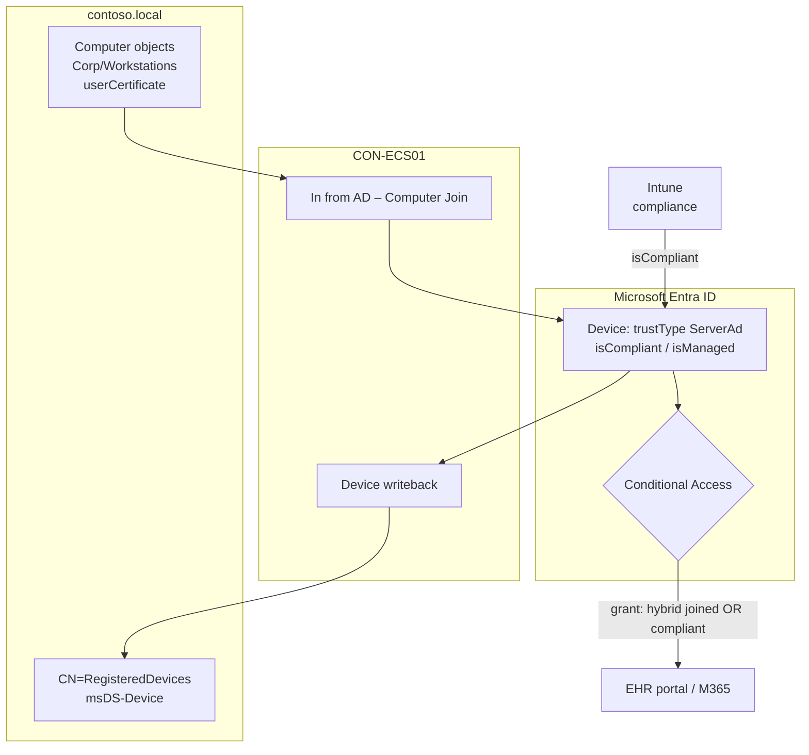

# 07 – Device Synchronization, Conditional Access and Zero Trust

> Part of the [Entra Connect playbook](../README.md). Related: [04 Hybrid Join](../04-Hybrid-Microsoft-Entra-Join/README.md) · [05 Intune](../05-Integrate-with-Intune/README.md) · [06 Groups](../06-Synchronize-Groups/README.md) · [10 Cloud migration](../10-Support-Cloud-Migration/README.md)

## Overview

Device synchronization has two directions:

| Direction | Feature | Purpose |
|---|---|---|
| **AD → Entra ID** | Computer object sync (default sync rules, part of hybrid join) | Creates the hybrid joined device object ([04](../04-Hybrid-Microsoft-Entra-Join/README.md)) that CA, Intune, and BitLocker escrow rely on |
| **Entra ID → AD** | **Device writeback** (optional feature) | Writes *Entra registered/joined* devices to AD (`CN=RegisteredDevices`) for **AD FS device-based CA** and **Windows Hello for Business hybrid certificate trust** |

The device identity then becomes a **signal** in Conditional Access:

| CA grant / condition | What it proves | Requires |
|---|---|---|
| **Require Microsoft Entra hybrid joined device** | The device is a corporate, domain-joined Windows device | Hybrid join + device sync |
| **Require device to be marked as compliant** | The device meets Intune compliance (BitLocker, AV, OS) | Intune enrollment ([05](../05-Integrate-with-Intune/README.md)) |
| **Filter for devices** (condition) | Device attributes (`trustType`, `isCompliant`, `extensionAttribute1-15`, `model`…) | Device object in Entra |
| Device platform (condition) | OS family | – |

> [!TIP]
> In Zero Trust terms, **hybrid joined = known**, **compliant = healthy**. A policy granting access when the device is *hybrid joined **OR** compliant* gets you through migration. The end state is *compliant* (which also covers Entra joined devices in [10](../10-Support-Cloud-Migration/README.md)).

> [!NOTE]
> Device writeback isn't needed for Conditional Access in Entra ID, Intune, or Windows Hello for Business **cloud Kerberos trust** (the recommended hybrid WHfB model). Enable it only for AD FS device-based CA or WHfB **certificate** trust.

## How It Works (Architecture)

**AD → Entra (device sync):** the default rule *In from AD – Computer Join* imports computer objects that have a **`userCertificate`** written by the device (Windows 10+). *Out to AAD – Device Join SOAInAD* exports them as devices with `trustType = ServerAd` (hybrid joined). Computers without a certificate are not exported.

**Entra → AD (device writeback):** registered/joined devices are written to `CN=RegisteredDevices,DC=contoso,DC=local` as `msDS-Device` objects. AD FS then reads them for on-premises device claims (`isRegisteredUser`, `isManaged`, `isCompliant`).



**Conditional Access evaluation flow:**

1. A user signs in from `CON-WS-0001`. The **PRT** carries the device ID (Edge natively, Chrome via the Microsoft Single Sign On extension or Windows accounts).
2. Entra looks up the device object: `trustType`, `isCompliant`, `isManaged`.
3. The policy grant evaluates to Grant or Block. The sign-in log shows *Device ID*, *Join type*, *Compliant*.

**Device writeback details:**

| Item | Value |
|---|---|
| Container | `CN=RegisteredDevices` (created by `Initialize-ADSyncDeviceWriteback`) |
| Wizard | **Configure > Customize synchronization options > Device options / Optional features > Device writeback** |
| Constraints | Devices must be in the **same forest as users**. **Single-tenant** only. Can take **up to 3 hours** to appear. |
| Schema | AD schema version 2012 R2+ (`msDS-Device` class) |

## Prerequisites

| Area | Requirement |
|---|---|
| Licensing | **Entra ID P1** for Conditional Access and for device writeback. P2 for risk conditions. Intune for compliance. |
| Device sync | Hybrid join configured ([04](../04-Hybrid-Microsoft-Entra-Join/README.md)), workstation OUs in scope |
| Compliance | Devices enrolled in Intune with an assigned compliance policy ([05](../05-Integrate-with-Intune/README.md)) |
| Device writeback | Schema 2012 R2+, Enterprise Admin to prepare AD (`Initialize-ADSyncDeviceWriteback`), Connect wizard as Hybrid Identity Administrator |
| CA roles | **Conditional Access Administrator** (or Security Administrator) |
| Break-glass | 2 cloud-only emergency accounts **excluded from every CA policy** |
| Browsers | Edge signed in to profile, or Chrome with the **Microsoft Single Sign On** extension / *CloudAPAuthEnabled* policy. Firefox needs *Windows SSO* enabled. |

## Step-by-Step Workflow

1. **Confirm device objects**: **Entra admin center > Entra ID > Devices > All devices**: hybrid joined pilot devices have a *Registered* date and *MDM = Microsoft Intune*.
2. **(Only if needed) Enable device writeback**
   1. On `CON-ECS01` as Enterprise Admin: `Initialize-ADSyncDeviceWriteback -DomainName contoso.local -AdConnectorAccount MSOL_xxx`.
   2. Wizard: **Configure > Customize synchronization options > Optional features** and tick **Device writeback**. Choose the forest on *Writeback forest*, then **Configure**.
3. **Design the CA policies** (report-only first)

   | Policy | Users | Apps | Conditions | Grant |
   |---|---|---|---|---|
   | `CA101-Require-MFA-AllUsers` | All users (exclude break-glass) | All resources | – | Require MFA |
   | `CA201-Windows-Require-HybridOrCompliant` | `GRP-Pilot-Users` | Office 365 + EHR portal | Device platforms: Windows | Require Entra hybrid joined **OR** compliant |
   | `CA202-Block-Unknown-Platforms` | All users | All resources | Platforms: any except Windows, iOS, Android, macOS | Block |
   | `CA203-Admin-Compliant-Only` | Directory roles (admins) | All resources | – | Require compliant device **AND** phishing-resistant MFA |

4. **Create the policy**: **Entra admin center > Entra ID > Conditional Access > Policies > + New policy**.
   1. **Users**: Include `GRP-Pilot-Users`. Exclude `bg01`, `bg02`.
   2. **Target resources**: Office 365, plus the *EHR Portal* enterprise app.
   3. **Conditions > Device platforms**: Include *Windows*.
   4. **Grant**: tick *Require Microsoft Entra hybrid joined device* and *Require device to be marked as compliant*. Select **Require one of the selected controls**.
   5. **Enable policy**: **Report-only**, then **Create**.
5. **Evaluate**: **Conditional Access > Insights and reporting** workbook and the *Report-only* tab in sign-in logs for 7 days.
6. **Use What If**: **Conditional Access > Policies > What If**. Set the user to alex.wilber, the app to Office 365, platform Windows, and *Device state*/filter values.
7. **Enforce**: switch to **On** for pilot, then widen to `All users` in waves (clinics → hospitals → HQ).
8. **Device filters (optional)**: target kiosk/shared clinical workstations with `device.extensionAttribute1 -eq "SharedClinical"` (set via Graph or Intune) to apply sign-in frequency rules.

## PowerShell / CLI Reference

```powershell
# Connect server: prepare AD for device writeback (Enterprise Admin)
Import-Module "C:\Program Files\Microsoft Azure Active Directory Connect\AdPrep\AdSyncPrep.psm1"
Initialize-ADSyncDeviceWriteback -DomainName "contoso.local" -AdConnectorAccount "MSOL_xxxxxxxx"

# DC: list devices written back by device writeback
Get-ADObject -SearchBase "CN=RegisteredDevices,DC=contoso,DC=local" -Filter "objectClass -eq 'msDS-Device'" -Properties displayName, msDS-IsManaged |
  Select-Object displayName, msDS-IsManaged

# Connect server: check which computers will NOT sync (no userCertificate)
Get-ADComputer -SearchBase "OU=Workstations,OU=Corp,DC=contoso,DC=local" -Filter * -Properties userCertificate |
  Where-Object { $_.userCertificate.Count -eq 0 } | Select-Object Name

# Device: confirm the device ID that CA will see
dsregcmd /status | Select-String "DeviceId|AzureAdJoined|DomainJoined|AzureAdPrt"
```

```powershell
# Microsoft Graph: device compliance and join type for CA troubleshooting
Connect-MgGraph -Scopes "Device.Read.All","Policy.Read.All","AuditLog.Read.All"
Get-MgDevice -Filter "displayName eq 'CON-WS-0001'" -Property DisplayName,TrustType,IsCompliant,IsManaged,DeviceId |
  Format-List DisplayName,TrustType,IsCompliant,IsManaged,DeviceId     # TrustType ServerAd = hybrid joined

# Microsoft Graph: list CA policies and their state (enabled / enabledForReportingButNotEnforced / disabled)
Get-MgIdentityConditionalAccessPolicy | Select-Object DisplayName, State

# Microsoft Graph: recent sign-ins for a user with device details and CA result
Get-MgAuditLogSignIn -Filter "userPrincipalName eq 'alex.wilber@contoso.com'" -Top 5 |
  Select-Object CreatedDateTime, AppDisplayName, ConditionalAccessStatus,
    @{n='TrustType';e={$_.DeviceDetail.TrustType}}, @{n='Compliant';e={$_.DeviceDetail.IsCompliant}}

# Microsoft Graph: tag a shared clinical workstation for CA device filters
Update-MgDevice -DeviceId <objectId> -BodyParameter @{ extensionAttributes = @{ extensionAttribute1 = "SharedClinical" } }
```

## Enterprise Lab

### Scenario

Contoso Healthcare's EHR portal (an Entra-integrated SAML app) holds patient data. Auditors require that PHI is only accessed from **corporate, healthy devices**. Today any device with a password + MFA works, including clinicians' home PCs. The organization wants a Zero Trust design that also survives the future move to Entra join.

### Lab Environment

Use the [shared lab](../README.md#shared-lab-environment--contoso-healthcare): `CON-ECS01`, `CON-WS-0001` (hybrid joined + Intune compliant), `CON-WS-0002` (hybrid joined, made non-compliant), a personal Windows 11 VM `HOME-PC` (not joined), `GRP-Pilot-Users`, and the break-glass accounts.

### Objectives

1. A report-only policy shows *would be blocked* for `HOME-PC` and *success* for `CON-WS-0001` within 1 day of testing.
2. After enforcement, `HOME-PC` is **blocked**, `CON-WS-0001` succeeds, and `CON-WS-0002` (non-compliant but hybrid joined) is **allowed** under the OR grant.
3. The admin policy blocks admin portal access from `CON-WS-0002` (compliance required).
4. Break-glass sign-in works from any device (exclusion verified).

### Lab Tasks

| # | Task | Steps | Expected result |
|---|---|---|---|
| 1 | Verify device signals | Graph `Get-MgDevice` for WS-0001/0002 | `TrustType ServerAd`. `IsCompliant` True / False. |
| 2 | Create CA201 report-only | Workflow step 4 | Policy in Report-only |
| 3 | Generate sign-ins | Sign in as alex.wilber to Outlook web from WS-0001, WS-0002, HOME-PC | Sign-in logs show report-only result per device |
| 4 | What If | Run What If for each device scenario | Matches task 3 |
| 5 | Enforce | Set CA201 to **On** | HOME-PC gets "You can't get there from here". Others succeed. |
| 6 | Admin policy | CA203 for Intune Administrator role. Lee.gu (admin) signs in from WS-0002. | Blocked: device must be compliant |
| 7 | Break-glass test | Sign in as `bg01` from HOME-PC | Succeeds (excluded). Alert fires (sign-in alert on break-glass). |

### Validation

- **Sign-in logs**: **Entra > Monitoring & health > Sign-in logs > (sign-in) > Conditional Access** tab shows the policy result. The **Device info** tab shows *Join type*, *Compliant*, *Managed*.
- **CA Insights workbook**: report-only impact per policy.
- **Sync**: the device's `OnPremisesSyncEnabled` is True. **Synchronization Service Manager** shows computer object exports.
- **Device**: `dsregcmd /status` shows `AzureAdPrt : YES` (without a PRT, the device can't be identified).
- **Audit logs**: Category *Policy*, Activity *Add conditional access policy / Update policy*.

### Break/Fix Exercise

| | |
|---|---|
| **Failure** | On `CON-WS-0001`, sign in with **Chrome without** the Microsoft Single Sign On extension (or Firefox without Windows SSO). |
| **Symptoms** | The CA201 block page appears on a **compliant, hybrid joined** device. The sign-in log shows *Device ID* empty and *Join type* blank. |
| **Diagnosis** | Same user in Edge succeeds. The sign-in log *Device info* is empty for the Chrome attempt, so the browser didn't send the PRT. |
| **Fix** | Deploy the Microsoft Single Sign On Chrome extension via Intune/GPO, or enable Chrome `CloudAPAuthEnabled`. Firefox: enable *Allow Windows single sign-on for Microsoft, work, and school accounts*. |

### Cleanup/Rollback

- Set CA201/CA203 back to **Report-only** or **Off**. Never delete break-glass exclusions.
- Device writeback: wizard **Optional features**, untick **Device writeback**. Objects in `CN=RegisteredDevices` remain until removed manually. Delete them only if AD FS no longer uses them.
- Remove the `extensionAttribute1` tag if it was added.

> [!WARNING]
> Enabling *Require hybrid joined / compliant* for **All users + All resources** without exclusions locks out admins, break-glass and service accounts. Always run report-only and What If first, and keep two excluded emergency accounts.

## Troubleshooting

| Symptom | Cause | Resolution |
|---|---|---|
| Compliant device blocked | Browser not passing device identity, or PRT missing | Edge / Chrome SSO extension. Check `AzureAdPrt : YES`. |
| Device not found in Entra | Computer OU not synced or no `userCertificate` | See [04](../04-Hybrid-Microsoft-Entra-Join/README.md) |
| `IsCompliant` false although Intune says compliant | Compliance not yet reported / duplicate device objects | Sync device in Intune. Remove stale duplicate device records. |
| Device writeback objects missing | Writeback not initialized, devices in another forest, multi-tenant | Re-run `Initialize-ADSyncDeviceWriteback`. Check constraints. Wait up to 3 hours. |
| AD FS device claims empty | Device writeback disabled, or AD FS not configured for device auth | Enable writeback and AD FS device authentication |
| Users blocked on mobile | Policy targets all platforms with hybrid join grant | Scope the hybrid grant to Windows. Use compliant/app protection for mobile. |
| Error `53000` | Device not compliant / not managed | Remediate compliance. User follows the Company Portal prompt. |
| Error `53003` | Blocked by CA | Read the policy result in the sign-in log |

**Logs:** Entra **Sign-in logs** (CA tab), **Audit logs** (Policy, Device), Intune **Device compliance** reports, `Microsoft-Windows-AAD/Operational` on the device, and Synchronization Service Manager for device export.

## Security & Best Practices

- **Least privilege:** use **Conditional Access Administrator** for CA changes. Enterprise Admin only once for `Initialize-ADSyncDeviceWriteback`.
- **Report-only first**, **What If** always, and stage rollouts by group.
- **Break-glass**: two cloud-only accounts, FIDO2, excluded from CA, and monitored with alerts.
- Protect **Tier 0**: the Connect server writes device objects. Compromising it could forge device state in AD (writeback).
- Clean stale and duplicate devices so `isCompliant` reflects reality.
- **Zero Trust policy design**: verify explicitly (MFA + device), use least-privilege access (per-app policies, admin policy stricter), and assume breach (sign-in frequency on shared devices, CAE, token protection for supported apps).
- Plan for **Entra join**. Write policies around **compliance** so they keep working when hybrid join is retired ([10](../10-Support-Cloud-Migration/README.md)).

## Interview / Exam Notes

- Device writeback needs **P1**. It is only for **AD FS device-based CA** and **WHfB hybrid certificate trust**, and is not needed for Entra CA.
- Writeback container: **`CN=RegisteredDevices`**. Same forest as users. Single tenant. Up to 3 hours.
- Hybrid joined devices sync only when the computer object has **`userCertificate`**.
- CA grant "**Require one of the selected controls**" with hybrid joined **OR** compliant is the migration-friendly pattern.
- Without a **PRT** passed by the browser, CA can't see the device. Edge does this natively. Chrome needs the extension.
- `trustType`: `ServerAd` = hybrid joined, `AzureAd` = Entra joined, `Workplace` = registered.
- Always exclude **break-glass** accounts and use **report-only** first.

## References

- [Microsoft Entra Connect: Enabling device writeback](https://learn.microsoft.com/entra/identity/hybrid/connect/how-to-connect-device-writeback)
- [Conditional Access: Grant controls](https://learn.microsoft.com/entra/identity/conditional-access/concept-conditional-access-grant)
- [Require device compliance or hybrid join with Conditional Access](https://learn.microsoft.com/entra/identity/conditional-access/policy-alt-all-users-compliant-hybrid-or-mfa)
- [Filter for devices](https://learn.microsoft.com/entra/identity/conditional-access/concept-condition-filters-for-devices)
- [Conditional Access: Report-only mode](https://learn.microsoft.com/entra/identity/conditional-access/concept-conditional-access-report-only)
- [Manage emergency access accounts](https://learn.microsoft.com/entra/identity/role-based-access-control/security-emergency-access)
- [Zero Trust deployment for endpoints](https://learn.microsoft.com/security/zero-trust/deploy/endpoints)
- [Conditional Access: Device identity in browsers (supported browsers)](https://learn.microsoft.com/entra/identity/conditional-access/concept-conditional-access-conditions)
