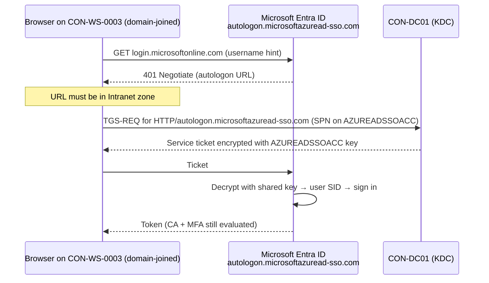

# 08 – Seamless Single Sign-On (Seamless SSO)

> Part of the [Entra Connect playbook](../README.md). Related: [02 Single identity](../02-Single-Identity-Same-Username-Password/README.md) · [03 PHS](../03-Password-Hash-Synchronization/README.md) · [04 Hybrid Join](../04-Hybrid-Microsoft-Entra-Join/README.md) · [10 Cloud migration](../10-Support-Cloud-Migration/README.md)

## Overview

**Microsoft Entra Seamless SSO** signs users in to Entra-protected apps automatically when they are on a **domain-joined device on the corporate network** (line of sight to a DC). It uses the user's existing **Kerberos** ticket, so there's no password prompt and often no username prompt. It works with **PHS** or **PTA** and doesn't apply to federated domains (AD FS already provides SSO).

| SSO mechanism | Device type | How | Line of sight to DC |
|---|---|---|---|
| **Primary Refresh Token (PRT)** | Entra joined / **hybrid joined** Windows 10+ | Token issued at Windows sign-in | No (after sign-in) |
| **Seamless SSO** | **Domain-joined** (incl. non-hybrid, downlevel, servers) | Kerberos ticket for `AZUREADSSOACC` | **Yes** |
| AD FS (WIA) | Domain-joined | Federation | Yes (or WAP) |

> [!TIP]
> On hybrid joined Windows 10/11, the **PRT** already gives SSO and takes precedence. Seamless SSO is the fallback for non-hybrid-joined domain machines, Citrix/RDS hosts, and browsers or apps that cannot use the PRT. Once every device is hybrid or Entra joined, plan to **retire Seamless SSO** ([10](../10-Support-Cloud-Migration/README.md)) and its Kerberos key.

## How It Works (Architecture)

1. When you enable Seamless SSO, Entra Connect creates a **computer account `AZUREADSSOACC`** in each AD forest (default `Computers` container). It registers SPNs for `https://autologon.microsoftazuread-sso.com`, and the account's **Kerberos decryption key** is shared securely with Entra ID.
2. The user browses to `https://myapps.microsoft.com` (or Outlook/Teams). Entra returns a `401 Unauthorized` challenge from `autologon.microsoftazuread-sso.com`.
3. The browser (which must treat that URL as **Intranet zone**) requests a Kerberos service ticket for `AZUREADSSOACC` from the DC.
4. The browser sends the ticket to Entra ID, which decrypts it with the shared key. It extracts the user's SID/UPN and signs them in.
5. MFA and Conditional Access still apply.



**Components and ports:**

| Item | Detail |
|---|---|
| Computer account | `AZUREADSSOACC$`, one per forest. **Protect it** (Tier 0 OU, no delegation). |
| SPNs | `HTTP/autologon.microsoftazuread-sso.com` (registered on the account) |
| Connect server → DC | 445 SMB and 3268 GC (account creation), 88/389 |
| Client → DC | Kerberos 88 |
| Client → Entra | 443 to `autologon.microsoftazuread-sso.com` |

**Kerberos key rollover:** the `AZUREADSSOACC` key is effectively a long-lived secret. Microsoft recommends rolling it over **at least every 30 days** with `Update-AzureADSSOForest`. Roll it over **once per forest** (not on each server, and not on staging servers). The admin account used must **not** be in *Protected Users*.

> [!NOTE]
> **RC4 deprecation:** The **July 2026** Windows Server update changes the default Kerberos encryption on DCs from RC4 to **AES-256** for accounts without explicit encryption types. Seamless SSO deployments that relied on RC4 for `AZUREADSSOACC` must be migrated. **Roll the key over first** (to create AES keys), then set `msDS-SupportedEncryptionTypes` on `AZUREADSSOACC$` to AES only. Test before DCs receive the change.

**Browser support (Windows):**

| Browser | Support | Notes |
|---|---|---|
| Microsoft Edge (Chromium) | Yes | Intranet zone setting required |
| Google Chrome | Yes | Uses Windows Intranet zone settings, or `AuthServerAllowlist` policy |
| Mozilla Firefox | Yes, with config | `network.negotiate-auth.trusted-uris` = `https://autologon.microsoftazuread-sso.com`. **Not in private mode.** |
| macOS Safari/Chrome/Firefox | Yes, domain-joined Macs with config | Requires Kerberos config |
| Mobile browsers (iOS/Android) | **No** | – |
| Microsoft 365 desktop apps | Yes | Version 16.0.8730.xxxx+ (non-interactive) |

## Prerequisites

| Area | Requirement |
|---|---|
| Licensing | Entra ID Free |
| Sign-in method | **PHS or PTA** (not federated domains) |
| Entra Connect | Current version. Domain Admin credentials **per forest** when enabling (to create `AZUREADSSOACC`). Not needed for ongoing sync. |
| Users | Synced from an in-scope forest. Not in too many groups (Kerberos ticket > **50 KB** header limit breaks it). |
| Forests | Up to 30 forests via the wizard. More than that needs manual enablement. |
| Network | Clients must reach a DC (Kerberos 88). `autologon.microsoftazuread-sso.com` reachable on 443 (bypass SSL inspection and do not proxy-authenticate it). |
| GPO | Ability to deploy **Site to Zone Assignment List** to user configuration |

## Step-by-Step Workflow

1. **Enable in Connect**: on `CON-ECS01`, open **Microsoft Entra Connect > Configure > Change user sign-in > Next**. Sign in as Hybrid Identity Administrator, keep **Password Hash Synchronization**, tick **Enable single sign-on**, then **Next**.
2. **Enter domain credentials**: on *Enable single sign-on*, click **Enter credentials** for `contoso.local` (Domain Admin), then **Next > Configure**.
3. **Verify in portal**: **Entra admin center > Entra ID > Entra Connect > Connect sync** shows *Seamless single sign-on: Enabled*. Select it to see `contoso.local` listed.
4. **Protect the account**: move `AZUREADSSOACC` to a Tier 0 OU (e.g. `Servers` with restricted GPO). Make sure it isn't touched by stale-computer cleanup scripts.
5. **Deploy the zone GPO**
   1. **Group Policy Management > Corp/Users > Create GPO** `CON-SeamlessSSO`.
   2. **User Configuration > Policies > Administrative Templates > Windows Components > Internet Explorer > Internet Control Panel > Security Page > Site to Zone Assignment List** = **Enabled**. Add value name `https://autologon.microsoftazuread-sso.com`, value `1` (Intranet).
   3. **User Configuration > Policies > Administrative Templates > Windows Components > Internet Explorer > Internet Control Panel > Security Page > Intranet Zone > Allow updates to status bar via script** = **Enabled** (needed for the username-less flow).
6. **Firefox (if used)**: deploy the Firefox policy `Authentication > SPNEGO` = `https://autologon.microsoftazuread-sso.com`.
7. **Test** on a domain-joined, **non-hybrid** device (to isolate Seamless SSO from the PRT) in a fresh InPrivate-off session: `https://myapps.microsoft.com`.
8. **Schedule key rollover**: run the rollover script monthly from a secured admin host. Record the date in the change log.

> [!WARNING]
> Do **not** put the URL in the **Trusted sites** zone. The browser then won't send Kerberos tickets and sign-in fails. Also don't add `https://autologon.microsoftazuread-sso.com` to a zone list that a separate user-preference GPO overwrites.

## PowerShell / CLI Reference

```powershell
# Run on CON-ECS01 from the Entra Connect install folder
cd "$env:ProgramFiles\Microsoft Azure Active Directory Connect"
Import-Module .\AzureADSSO.psd1

# Authenticate to Entra (Hybrid Identity Administrator)
New-AzureADSSOAuthenticationContext

# Show feature state and the forests it is enabled for (with last key rollover time)
Get-AzureADSSOStatus | ConvertFrom-Json

# Roll over the Kerberos decryption key for ONE forest (Domain Admin of that forest; not in Protected Users)
$creds = Get-Credential "CONTOSO\da-leegu"
Update-AzureADSSOForest -OnPremCredentials $creds

# Disable Seamless SSO for a forest that no longer needs it
Disable-AzureADSSOForest -DomainFqdn "contoso.local"

# Disable the feature tenant-wide (then delete AZUREADSSOACC in each forest)
Enable-AzureADSSO -Enable $false
```

```powershell
# On a DC: inspect the computer account, SPNs, key age and encryption types
Get-ADComputer AZUREADSSOACC -Properties servicePrincipalName, PasswordLastSet, 'msDS-SupportedEncryptionTypes' |
  Format-List Name, DistinguishedName, servicePrincipalName, PasswordLastSet, msDS-SupportedEncryptionTypes

# After rolling the key over: restrict to AES only (0x18 = AES128 + AES256)
Set-ADComputer AZUREADSSOACC -Replace @{ 'msDS-SupportedEncryptionTypes' = 24 }

# On a client: list Kerberos tickets; look for HTTP/autologon.microsoftazuread-sso.com
klist
klist purge   # clear tickets before re-testing
```

## Enterprise Lab

### Scenario

Contoso Healthcare's hospitals run about 600 shared domain-joined Citrix and nursing-station machines that are **not** hybrid joined (non-persistent VDI). Clinicians type their password up to 20 times per shift, which slows medication rounds. The CISO approves Seamless SSO for on-network devices but requires a monthly key rollover and AES-only Kerberos.

### Lab Environment

Use the [shared lab](../README.md#shared-lab-environment--contoso-healthcare): `CON-DC01`, `CON-ECS01`, `CON-ECS02` (staging), `CON-WS-0003` (domain-joined, **not** hybrid joined), and the users `alex.wilber` and `lee.gu` (admin for rollover).

### Objectives

1. `AZUREADSSOACC` exists in `contoso.local`, and the portal shows Seamless SSO **Enabled**.
2. alex.wilber reaches `myapps.microsoft.com` on `CON-WS-0003` **without a password prompt**, and the sign-in log shows *Seamless SSO*.
3. The Kerberos key is rolled over and `PasswordLastSet` on `AZUREADSSOACC` updates.
4. `msDS-SupportedEncryptionTypes` = 24 (AES) and SSO still works.

### Lab Tasks

| # | Task | Steps | Expected result |
|---|---|---|---|
| 1 | Enable | Workflow steps 1–3 | Portal Enabled. Computer account present. |
| 2 | GPO | Workflow step 5, linked to `Corp/Users` | `gpresult /r` shows `CON-SeamlessSSO` |
| 3 | Test SSO | On `CON-WS-0003`, open Edge to `myapps.microsoft.com` | Signed in silently (may need username once without the status-bar setting) |
| 4 | Ticket check | `klist` | Ticket for `HTTP/autologon.microsoftazuread-sso.com` |
| 5 | Roll over key | Run the `Update-AzureADSSOForest` commands as `lee.gu` | `Get-AzureADSSOStatus` shows a new timestamp. `PasswordLastSet` = today. |
| 6 | AES only | `Set-ADComputer … 24`, `klist purge`, retest | SSO still works. `klist` shows AES256 etype. |
| 7 | Staging check | Confirm **no** rollover is run on `CON-ECS02` | Documented in runbook |

### Validation

- **Portal**: **Entra Connect > Connect sync > Seamless single sign-on** shows Enabled, with forest `contoso.local`.
- **Sign-in logs**: **Monitoring & health > Sign-in logs > (alex.wilber) > Authentication Details**: *Seamless SSO*. Error **81010/81012** = Seamless SSO failure (see below).
- **Client**: `klist` shows the autologon ticket. **Internet Options > Security > Local intranet > Sites > Advanced** lists the URL (greyed: from GPO).
- **DC Security log**: event **4769** (Kerberos service ticket requested) for service `AZUREADSSOACC$`.
- **Sync logs**: no impact on Synchronization Service Manager (Seamless SSO is not a run profile), and Connect Health shows no alerts.

### Break/Fix Exercise

| | |
|---|---|
| **Failure** | Change the GPO zone value from `1` (Intranet) to `2` (Trusted sites). |
| **Symptoms** | Users get a username/password prompt again. No `autologon` ticket appears in `klist`. Sign-in logs show a normal password sign-in, because Seamless SSO was never attempted. |
| **Diagnosis** | **Internet Options > Security** shows the URL under *Trusted sites*. `gpresult /h` shows the value 2. |
| **Fix** | Set the value back to `1`, run `gpupdate /force`, and sign out/in (or `klist purge`). Silent sign-in returns. |

### Cleanup/Rollback

- Disable: wizard **Change user sign-in** > untick **Enable single sign-on**, or run `Enable-AzureADSSO -Enable $false`. Then **delete `AZUREADSSOACC`** in each forest and remove the GPO.
- Revert `msDS-SupportedEncryptionTypes` (clear the attribute) only if a legacy client truly needs RC4. Document the exception.

## Troubleshooting

| Symptom | Cause | Resolution |
|---|---|---|
| Still prompted for password | URL not in Intranet zone, or in Trusted sites | Fix the Site to Zone GPO (value 1) |
| Prompted for username only | *Allow updates to status bar via script* not enabled | Enable the setting, or use `login_hint`/domain_hint in app links |
| Works in Edge, not Firefox | Firefox SPNEGO not configured / private mode | Set `network.negotiate-auth.trusted-uris`. No private mode. |
| Fails for some users only | Kerberos ticket too large (too many groups, > 50 KB header) | Reduce group memberships |
| Fails after DC hardening | RC4 removed, AZUREADSSOACC has only RC4 key | Roll the key over, set AES encryption types |
| Error 81001 | Ticket too large | Reduce group memberships |
| Error 81010 | Seamless SSO failed (expired/invalid Kerberos ticket, or key mismatch) | Roll over the key, `klist purge`, retry |
| `AZUREADSSOACC` deleted by cleanup | Stale computer script | Re-enable Seamless SSO in the wizard (recreates it), and exclude it from cleanup |

**Logs:** Entra **Sign-in logs** (Authentication Details, error codes 81xxx). DC Security log (4769). Client `klist`. Connect wizard trace `%ProgramData%\AADConnect\trace-*.log`.

## Security & Best Practices

- **`AZUREADSSOACC` is a Tier 0 secret.** Anyone who obtains its key can forge tickets for any synced user to Entra ID (silver-ticket style). Restrict who can read/reset it, and monitor changes (event **4742**).
- **Roll over the key at least every 30 days.** Automate it with a secured, monitored runbook (use a credential from a vault, not a plaintext file).
- Use **AES-only** encryption types after rolling over. Track the RC4 deprecation in Windows Server updates.
- **Least privilege:** Domain Admin is needed only at enable/rollover time, so use JIT elevation.
- Keep `CON-ECS01/02` in **Tier 0**. The staging server must not roll over the key.
- **Zero Trust:** Seamless SSO removes the password prompt, not the **MFA/CA** checks. Keep risk- and device-based CA in place ([07](../07-Device-Synchronization/README.md)).

## Interview / Exam Notes

- Seamless SSO works with **PHS or PTA**, not federation. It needs **line of sight to a DC**.
- It creates the computer account **`AZUREADSSOACC`** per forest. The **SPN** is `autologon.microsoftazuread-sso.com`.
- The URL must be in the **Intranet zone (1)**. Trusted sites breaks it.
- **Roll the key over every 30 days**: `Update-AzureADSSOForest -OnPremCredentials`. Run once per forest, never on a staging server.
- PRT-based SSO on hybrid/Entra joined devices takes precedence over Seamless SSO.
- Not supported on mobile browsers or Firefox private mode. Header limit **50 KB**.
- The RC4 → AES change means rolling the key over and setting `msDS-SupportedEncryptionTypes`.

## References

- [Microsoft Entra Seamless single sign-on](https://learn.microsoft.com/entra/identity/hybrid/connect/how-to-connect-sso)
- [Seamless SSO: Quickstart](https://learn.microsoft.com/entra/identity/hybrid/connect/how-to-connect-sso-quick-start)
- [Seamless SSO: Technical deep dive](https://learn.microsoft.com/entra/identity/hybrid/connect/how-to-connect-sso-how-it-works)
- [Seamless SSO: Frequently asked questions (key rollover, encryption)](https://learn.microsoft.com/entra/identity/hybrid/connect/how-to-connect-sso-faq)
- [Troubleshoot Seamless SSO](https://learn.microsoft.com/entra/identity/hybrid/connect/tshoot-connect-sso)
- [Primary Refresh Token](https://learn.microsoft.com/entra/identity/devices/concept-primary-refresh-token)
