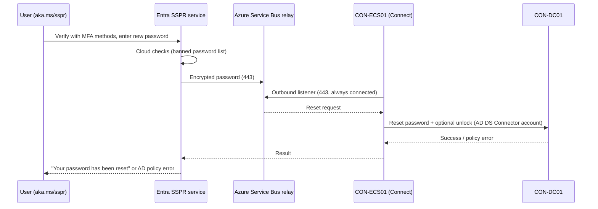

# 09 – Password Writeback

> Part of the [Entra Connect playbook](../README.md). Related: [03 PHS](../03-Password-Hash-Synchronization/README.md) · [02 Single identity](../02-Single-Identity-Same-Username-Password/README.md) · [10 Cloud migration](../10-Support-Cloud-Migration/README.md)

## Overview

**Password writeback** writes password changes made in the cloud back to on-premises AD **in real time**. It makes **Self-Service Password Reset (SSPR)** usable for synced users and keeps one password across AD and Entra ID ([02](../02-Single-Identity-Same-Username-Password/README.md)). Without writeback, synced users cannot reset their password from the cloud.

Cloud events that trigger writeback:

| Event | Written back? |
|---|---|
| User resets a forgotten password via SSPR (`aka.ms/sspr`) | Yes |
| User changes password at `myaccount.microsoft.com` / Ctrl+Alt+Del on Entra joined device | Yes |
| Admin resets a user's password in the Entra admin center | Yes |
| ID Protection **user-risk remediation** (secure password change) | Yes |
| Password expired: forced change at cloud sign-in (with cloud password policy) | Yes |
| Admin sets password via Microsoft Graph / PowerShell | Yes (when writeback enabled) |

| Option | Engine | Notes |
|---|---|---|
| **Entra Connect Sync password writeback** | Connect Sync server | Mature. Also supports **unlocking** accounts. |
| **Cloud Sync password writeback** | Provisioning agent (gMSA) | Lighter. Can coexist with Connect Sync for the same users. |

> [!NOTE]
> Password writeback and SSPR with writeback require **Microsoft Entra ID P1** (or Microsoft 365 Business Premium / E3 / E5). Users without P1 can still use SSPR *for cloud-only accounts* only.

## How It Works (Architecture)

1. When writeback is enabled, Entra Connect registers an endpoint with the **Microsoft Entra password reset service**, using **Azure Service Bus relay**. All traffic is **outbound 443** from the Connect server, with no inbound firewall rules.
2. The user completes SSPR (MFA methods + new password). Entra checks the **cloud** password policy (banned passwords, plus on-premises Password Protection if deployed).
3. The password is encrypted with a key that the Connect server generated, and sent through the relay.
4. The Connect server receives it and resets the password in AD using the **AD DS Connector account**. It honours the **AD password policy** (complexity, history, **minimum password age**).
5. Success or a specific AD error (e.g. "doesn't meet policy") is returned to the user **synchronously**. With PHS, the new hash syncs back within about 2 minutes ([03](../03-Password-Hash-Synchronization/README.md)).



**Required AD DS Connector account permissions** (on each domain root, applied to **descendant User objects**, unless noted):

| Permission | Why |
|---|---|
| **Reset password** | Set a new password without knowing the old one |
| **Change password** | Change password flows |
| **Write `lockoutTime`** | Unlock accounts |
| **Write `pwdLastSet`** | Handle "must change at next logon" and expiry |
| **Unexpire Password** (extended right, on the **domain root**, *This object and all descendant objects*) | Allow reset of expired passwords |

Use `Set-ADSyncPasswordWritebackPermissions` to grant them. Protected accounts (`adminCount=1`) don't inherit these ACEs because AdminSDHolder overwrites them, so **writeback fails for AD admin accounts by design**. Keep it that way: admins shouldn't use SSPR for AD privileged accounts.

## Prerequisites

| Area | Requirement |
|---|---|
| Licensing | **Entra ID P1** for every user who uses SSPR with writeback |
| Entra Connect | Supported current version. PHS or PTA (works with federation too). |
| AD permissions | Writeback permissions above for the AD DS Connector account. **Minimum password age = 0** strongly recommended (otherwise a reset within 1 day of a change fails). |
| Network | Outbound **443** from `CON-ECS01` to `*.servicebus.windows.net` and `passwordreset.microsoftonline.com`. No SSL inspection on these. |
| Entra roles | Hybrid Identity Administrator (wizard). **Authentication Policy Administrator** / Global Administrator to configure SSPR. |
| Authentication methods | Users registered for SSPR methods (combined registration). Microsoft Authenticator + phone recommended. |
| Staging server | Writeback is only active on the **active** server. A staging server takes over after promotion. |

## Step-by-Step Workflow

1. **Find the AD DS Connector account**: Connect wizard > **View current configuration** (*Synchronized Directories* shows `CONTOSO\MSOL_xxxxxxxx`), or **Synchronization Service Manager > Connectors > contoso.local > Properties > Connect to Active Directory Forest**.
2. **Grant permissions** (Enterprise/Domain Admin on `CON-ECS01`): run `Set-ADSyncPasswordWritebackPermissions` (see reference).
   - *Manual alternative:* **ADUC > View > Advanced Features > domain root > Properties > Security > Advanced > Add > principal MSOL_xxx > Applies to: Descendant User objects**: Reset password, Change password, Write lockoutTime, Write pwdLastSet. Then **Add > Applies to: This object and all descendant objects > Unexpire Password**.
3. **Set minimum password age**: **Group Policy Management > Default Domain Policy > Computer Configuration > Policies > Windows Settings > Security Settings > Account Policies > Password Policy > Minimum password age = 0** (or use a Fine-Grained Password Policy for SSPR users).
4. **Enable writeback in Connect**: wizard **Configure > Customize synchronization options > Optional features**, tick **Password writeback**, then **Configure**.
5. **Enable in SSPR**: **Entra admin center > Protection > Password reset > On-premises integration**:
   - **Enable password write back for synced users** = Yes
   - **Allow users to unlock accounts without resetting their password** = Yes (optional)
   - Save.
6. **Configure SSPR**: **Protection > Password reset > Properties**, *Self service password reset enabled* = **Selected** > `GRP-Pilot-Users`. Under **Authentication methods**: number of methods = 2 (Authenticator notification + mobile phone/email).
7. **Registration**: **Password reset > Registration**, *Require users to register when signing in* = Yes, re-confirm every 180 days.
8. **Windows sign-in screen SSPR** (optional): Intune **Settings catalog > Authentication > Allow Aad Password Reset** = Allow for Entra/hybrid joined Windows 10+ devices.
9. **End-to-end test** (lab below).

## PowerShell / CLI Reference

```powershell
# Grant password writeback permissions to the AD DS Connector account (run as Enterprise/Domain Admin)
Import-Module "C:\Program Files\Microsoft Azure Active Directory Connect\AdSyncConfig\AdSyncConfig.psd1"
Set-ADSyncPasswordWritebackPermissions -ADConnectorAccountName "MSOL_xxxxxxxx" -ADConnectorAccountDomain "contoso.local"

# Scope permissions to one OU instead of the domain root (least privilege)
Set-ADSyncPasswordWritebackPermissions -ADConnectorAccountName "MSOL_xxxxxxxx" -ADConnectorAccountDomain "contoso.local" `
  -ADObjectDN "OU=Users,OU=Corp,DC=contoso,DC=local"

# Inspect the ACL for the connector account on the Users OU
(Get-Acl "AD:OU=Users,OU=Corp,DC=contoso,DC=local").Access |
  Where-Object IdentityReference -like "*MSOL_*" | Select-Object ActiveDirectoryRights, ObjectType, InheritedObjectType

# Check whether writeback is enabled on the Entra connector
Import-Module ADSync
Get-ADSyncAADPasswordResetConfiguration -Connector (Get-ADSyncConnector | Where-Object Type -eq "Extensible2").Name

# Check domain minimum password age (should be 0 for reliable SSPR)
Get-ADDefaultDomainPasswordPolicy | Select-Object MinPasswordAge, ComplexityEnabled, PasswordHistoryCount

# Is the user protected by AdminSDHolder (writeback will fail by design)?
Get-ADUser megan.bowen -Properties adminCount | Select-Object SamAccountName, adminCount

# Cloud Sync equivalent: grant writeback permissions to the provisioning agent gMSA
Set-AADCloudSyncPermissions -PermissionType PasswordWriteBack -TargetDomain "contoso.local" -EACredential (Get-Credential)
```

```powershell
# Microsoft Graph: SSPR registration status for pilot users
Connect-MgGraph -Scopes "AuditLog.Read.All","UserAuthenticationMethod.Read.All"
Get-MgReportAuthenticationMethodUserRegistrationDetail -Filter "userPrincipalName eq 'megan.bowen@contoso.com'" |
  Select-Object UserPrincipalName, IsSsprRegistered, IsSsprCapable, MethodsRegistered

# Microsoft Graph: audit events for self-service reset
Get-MgAuditLogDirectoryAudit -Filter "loggedByService eq 'Self-service Password Management'" -Top 10 |
  Select-Object ActivityDateTime, ActivityDisplayName, Result, @{n='User';e={$_.TargetResources[0].UserPrincipalName}}
```

## Enterprise Lab

### Scenario

Contoso Healthcare's help desk handles about 1,100 password reset and unlock calls a month, peaking at night shift change when clinicians are locked out of nursing stations. Each call takes about 8 minutes. The goal is that ≥ 60% of resets are self-service in 3 months, with the new password working on-premises immediately.

### Lab Environment

Use the [shared lab](../README.md#shared-lab-environment--contoso-healthcare): `CON-DC01`, `CON-ECS01` (active), `CON-ECS02` (staging), the user `megan.bowen` (SSPR test user, member of `GRP-Pilot-Users`), the admin `lee.gu`, and `CON-WS-0001`. Entra ID **P1** is required (included in E5).

### Objectives

1. `megan.bowen` resets her password via `aka.ms/sspr` and signs in to `CON-WS-0001` with the new password **within 1 minute**.
2. A locked-out AD account is unlocked through SSPR without a password change.
3. A reset attempt that violates AD policy returns a **clear error to the user** (proves synchronous writeback).
4. Writeback for an `adminCount=1` account fails as designed and is documented.

### Lab Tasks

| # | Task | Steps | Expected result |
|---|---|---|---|
| 1 | Permissions | Workflow steps 1–2 | ACEs present (ACL query shows Reset/Change password, lockoutTime, pwdLastSet) |
| 2 | Min age | Workflow step 3, `gpupdate` on DCs | `MinPasswordAge 00:00:00` |
| 3 | Enable | Workflow steps 4–7 | On-premises integration shows *Your On-Premises Client is up and running* |
| 4 | Register | megan.bowen signs in to `aka.ms/mysecurityinfo` | Two methods registered |
| 5 | Reset | InPrivate > `aka.ms/sspr` > megan.bowen > verify > new password | "Your password has been reset". Events 31001 → 31002 on ECS01. |
| 6 | On-prem check | Sign in to `CON-WS-0001` with the new password | Success immediately |
| 7 | Unlock | Lock megan out (5 bad attempts), then SSPR > *I know my password, unlock* | Account unlocked. `lockoutTime` = 0. |
| 8 | Policy violation | Reset to a password reused from history | User sees "doesn't meet on-premises policy" |
| 9 | Protected account | Try SSPR for an account in Domain Admins (`adminCount=1`) | Fails, access denied (by design) |

### Validation

- **Portal**: **Protection > Password reset > On-premises integration** shows a green "up and running" status. **Password reset > Audit logs** shows *Reset password (self-service)*, *Success*.
- **Audit logs**: Service *Self-service Password Management*. Activities *Self-service password reset flow activity progress* and *Reset password (self-service)*.
- **Connect server Application log**: source **PasswordResetService**: **31001** (reset started) then **31002** (success). **31003** = failure, with the detail in an **ADSync 6329** event (see table).
- **AD**: `Get-ADUser megan.bowen -Properties pwdLastSet, lockoutTime` shows `pwdLastSet` = now.
- **Sync**: within ~2 minutes PHS syncs the new hash, with event 656/657 ([03](../03-Password-Hash-Synchronization/README.md)).

### Break/Fix Exercise

| | |
|---|---|
| **Failure** | Block outbound 443 from `CON-ECS01` to `*.servicebus.windows.net` at the firewall. |
| **Symptoms** | SSPR fails with "We're sorry, we can't reset your password at this time" (on-premises service unavailable). The portal *On-premises integration* shows the client **not** connected. The Connect server Application log shows **32002 ServiceBusError** / **31034 ServiceBusListenerError**, and the **31019** heartbeat events stop. |
| **Diagnosis** | `Test-NetConnection <namespace>.servicebus.windows.net -Port 443` fails. The firewall log shows drops. Directory sync still works (different endpoints). |
| **Fix** | Allow outbound 443 to Service Bus and the password reset endpoints. Restart the **ADSync** service to re-establish the listener. Status returns to green. |

### Cleanup/Rollback

- Disable: SSPR **On-premises integration** > *Enable password write back* = No, **and** wizard **Optional features**, untick Password writeback.
- Remove ACEs if desired: reverse via ADUC Advanced Security, or rebuild from a documented ACL baseline.
- Restore the original minimum password age if policy requires it (use a fine-grained policy for SSPR users instead).

> [!WARNING]
> If the minimum password age is > 0, a user who changed their password today cannot reset it via SSPR until tomorrow. This is the #1 cause of "SSPR doesn't work" tickets.

## Troubleshooting

| Symptom | Cause | Resolution |
|---|---|---|
| "Password doesn't meet on-premises policy" | Complexity, history, or **minimum password age** | Choose another password. Set min age 0. |
| Access denied on reset | Missing ACEs, or `adminCount=1` user | Run `Set-ADSyncPasswordWritebackPermissions`. Admins: by design. |
| On-premises client not reachable | Outbound 443 to Service Bus blocked, ADSync stopped, TLS 1.2 issue | Fix the firewall, start ADSync, enable TLS 1.2 |
| Writeback option greyed out in portal | Writeback not enabled in Connect / no P1 | Enable in the wizard. Assign P1. |
| Unlock not offered | *Allow users to unlock accounts* = No | Enable it in On-premises integration |
| Works on ECS01, fails after DR switch | Staging server promoted without writeback configured | Configure identical optional features on the staging server |
| Resets slow / time out | DC far away / RPC issues | Set a preferred DC on the AD connector, check AD replication |
| `SSPR_0029` on-premises configuration error | *Network access: Restrict clients allowed to make remote calls to SAM* excludes the connector account | Add `MSOL_xxx` to that policy on the Connect server and DCs |

**Event IDs (Application log on the Connect server):**

| Source | ID | Meaning |
|---|---|---|
| PasswordResetService | 31001 | Reset request received from the cloud (start of every operation) |
| PasswordResetService | 31002 | Password written to AD successfully |
| PasswordResetService | 31003 | Reset failed in AD (policy, permissions, protected account) |
| PasswordResetService | 31015 / 31016 | Writeback service started / stopped |
| PasswordResetService | 31019 | Service Bus heartbeat (healthy) |
| PasswordResetService | 31034 / 32002 | Service Bus listener / connection error (firewall, TLS root CAs) |
| PasswordResetService | 33001 | Unknown AD error (check ADSync events; reserved characters in OU names) |
| ADSync | 6329 | Password set failed: restriction (age/history/complexity), access denied, or DCs missing the LDAP password policy hints control |

**Logs:** the SSPR **Audit logs** in the Entra admin center. The Application log on `CON-ECS01`. Entra **Connect Health** alerts. The `%ProgramData%\AADConnect\trace-*.log` wizard traces.

## Security & Best Practices

- **Least privilege:** scope writeback ACEs to user OUs (`-ADObjectDN`), not the domain root. Never grant them on Tier 0 OUs.
- **Exclude privileged AD accounts** from SSPR. They are protected by AdminSDHolder anyway. Cloud admins use separate cloud-only accounts with their own admin SSPR policy.
- Require **2 strong methods** (Authenticator + phone/FIDO2). Avoid security questions for clinicians, because they are guessable.
- Deploy **Microsoft Entra Password Protection** for AD DS so banned-password rules apply on-premises too.
- Combine with **ID Protection user-risk policy** so leaked-credential users perform a secure change, written back automatically ([03](../03-Password-Hash-Synchronization/README.md)).
- Keep `CON-ECS01/02` in **Tier 0**, because they can reset any in-scope user's password.
- **Zero Trust:** self-service with strong verification beats help-desk resets vulnerable to social engineering.

## Interview / Exam Notes

- Password writeback requires **Entra ID P1**.
- Traffic is **outbound 443** via **Azure Service Bus relay**, with no inbound ports.
- AD DS Connector permissions: **Reset password, Change password, Write lockoutTime, Write pwdLastSet**, plus **Unexpire Password** on the domain root.
- Use `Set-ADSyncPasswordWritebackPermissions` (Connect Sync) or `Set-AADCloudSyncPermissions -PermissionType PasswordWriteBack` (Cloud Sync).
- Writeback is **synchronous**: AD policy errors are returned to the user.
- **Minimum password age** > 0 blocks resets shortly after a change.
- `adminCount=1` (AdminSDHolder) accounts fail writeback by design.
- Works with PHS, PTA, and federation.

## References

- [How does SSPR writeback work?](https://learn.microsoft.com/entra/identity/authentication/concept-sspr-writeback)
- [Tutorial: Enable SSPR writeback](https://learn.microsoft.com/entra/identity/authentication/tutorial-enable-sspr-writeback)
- [Tutorial: Enable users to unlock their account or reset passwords using SSPR](https://learn.microsoft.com/entra/identity/authentication/tutorial-enable-sspr)
- [Configure AD DS Connector account permissions](https://learn.microsoft.com/entra/identity/hybrid/connect/how-to-connect-configure-ad-ds-connector-account)
- [Troubleshoot SSPR writeback](https://learn.microsoft.com/entra/identity/authentication/troubleshoot-sspr-writeback)
- [Enable Cloud Sync password writeback](https://learn.microsoft.com/entra/identity/authentication/tutorial-enable-cloud-sync-sspr-writeback)
- [Licensing requirements for SSPR](https://learn.microsoft.com/entra/identity/authentication/concept-sspr-licensing)
- [Microsoft Entra Password Protection for AD DS](https://learn.microsoft.com/entra/identity/authentication/concept-password-ban-bad-on-premises)
