# 10 – Support Cloud Migration

> Part of the [Entra Connect playbook](../README.md). Builds on every other topic: [01](../01-Synchronize-Users-to-Microsoft-365/README.md) · [03 PHS](../03-Password-Hash-Synchronization/README.md) · [04 Hybrid Join](../04-Hybrid-Microsoft-Entra-Join/README.md) · [05 Intune](../05-Integrate-with-Intune/README.md) · [06 Groups](../06-Synchronize-Groups/README.md) · [07 CA](../07-Device-Synchronization/README.md) · [08 Seamless SSO](../08-Seamless-SSO/README.md) · [09 Writeback](../09-Password-Writeback/README.md)

## Overview

Entra Connect is the bridge between the on-premises estate and the cloud. Migration means **removing on-premises dependencies one layer at a time** while Connect keeps identities consistent:

| Layer | From | To | Tool / feature |
|---|---|---|---|
| Authentication | AD FS federation (or PTA) | **Managed auth: PHS** (+ cloud MFA / CBA) | **Staged rollout**, then domain conversion |
| Device identity | Hybrid joined | **Entra joined** + Intune (Autopilot) | Device refresh / reset |
| Device management | GPO / ConfigMgr | **Intune** | Co-management workloads, Settings catalog |
| Groups | AD-mastered groups | **Cloud-mastered** groups | Group **Source of Authority** conversion + Cloud Sync provisioning to AD ([06](../06-Synchronize-Groups/README.md)) |
| App access | AD FS relying parties, Kerberos/LDAP apps | Entra enterprise apps (SAML/OIDC), **Entra Private Access / App Proxy** | AD FS app migration, Kerberos SSO via App Proxy |
| Sync engine | Old Connect Sync | Current Connect Sync with app-based auth, or **Cloud Sync** | Upgrade / swing migration |

| Authentication end state | Pros | Cons |
|---|---|---|
| **PHS** (recommended) | No on-premises dependency at sign-in, leaked credentials, simplest | Disable state syncs on cycle (mitigated by CAE) |
| PTA | Immediate AD policy enforcement | Keeps agents + DCs in the sign-in path |
| Stay on AD FS | Custom claims, on-premises MFA | Highest cost and attack surface. Token-signing cert theft risk. |

> [!NOTE]
> **Staged rollout** is a **temporary** migration tool, not a permanent hybrid state. Microsoft supports it for testing cloud authentication with selected groups. Once validated, convert the domain from federated to managed and remove the groups.

> [!NOTE]
> Plan sync engine work into the timeline: Connect Sync must be on **2.6.84.0+ with application-based authentication by April 7, 2027**. Do this before or alongside the authentication migration ([01](../01-Synchronize-Users-to-Microsoft-365/README.md)).

## How It Works (Architecture)

**Staged rollout:** while `contoso.com` remains **federated**, users in selected groups are sent to cloud authentication (PHS or PTA, optionally with Seamless SSO) instead of AD FS. Everyone else still federates. It is configured in **Entra admin center > Entra ID > Entra Connect > Connect sync > Enable staged rollout for managed user sign-in**.

| Staged rollout limit / behavior | Value |
|---|---|
| Features | Password hash sync, Pass-through authentication, Seamless SSO, Certificate-based authentication, Microsoft Entra MFA |
| Groups per feature | Max **10** |
| Group type | Security groups. **No nested or dynamic groups.** |
| First add of a group | Max **200 users** in the initial add (larger groups: add first, then add members) |
| Propagation | Changes can take up to **24 hours** |
| Prerequisite | PHS already enabled in Connect (for the PHS feature). Seamless SSO enabled per forest if used. |
| Not supported | Legacy authentication falls back to federation. Some SSPR writeback flows aren't guaranteed. Windows 10 hybrid join PRT for staged users needs **Windows 10 1903+**. |

**Domain conversion:** after the pilot, convert `contoso.com` to managed (wizard *Change user sign-in*, or Graph). From then on, every user authenticates in the cloud. AD FS is retired after its relying parties are migrated.

```mermaid
flowchart LR
    subgraph P0[Phase 0 – Prepare]
        A0[Upgrade Connect 2.6.84+<br/>app-based auth]
        A1[Enable PHS<br/>alongside AD FS]
        A2[Inventory AD FS RPs]
    end
    subgraph P1[Phase 1 – Pilot auth]
        B1[Staged rollout<br/>GRP-Pilot-Users<br/>PHS + Seamless SSO]
    end
    subgraph P2[Phase 2 – Cutover]
        C1[Convert contoso.com<br/>Federated → Managed]
        C2[Migrate apps to Entra]
        C3[Decommission AD FS/WAP]
    end
    subgraph P3[Phase 3 – Devices]
        D1[Autopilot Entra join<br/>for refresh]
        D2[Intune workloads 100%]
        D3[Cloud Kerberos trust<br/>for on-prem resources]
    end
    subgraph P4[Phase 4 – Reduce AD]
        E1[Cloud-mastered groups<br/>SOA conversion]
        E2[Retire Seamless SSO,<br/>hybrid join SCP]
    end
    A0 --> A1 --> A2 --> B1 --> C1 --> C2 --> C3 --> D1 --> D2 --> D3 --> E1 --> E2
```



**Hybrid join → Entra join:** an existing device can't be converted in place. The supported paths are:

1. **Autopilot reset / wipe** of the device into Entra join (user-driven), or new hardware.
2. Entra joined devices reach on-premises file shares and apps with **Kerberos** through **Microsoft Entra Kerberos / cloud Kerberos trust** (WHfB) or a password-based PRT → TGT, as long as they have line of sight to a DC.
3. Policies move from GPO to **Intune Settings catalog** (use **Group Policy analytics** to map GPOs).

## Prerequisites

| Area | Requirement |
|---|---|
| Licensing | Entra ID P1 (CA, staged rollout groups, writeback). Intune for device management. P2 for risk-based CA (recommended before removing AD FS controls). |
| Entra Connect | Current supported version. **PHS enabled** before staged rollout. Seamless SSO per forest if used ([08](../08-Seamless-SSO/README.md)). |
| Roles | **Hybrid Identity Administrator** (staged rollout + domain conversion), Application Administrator (app migration), Intune Administrator |
| AD FS | Admin access to export relying party trusts. Run the **AD FS application activity report** (Connect Health for AD FS) to find what still uses AD FS. |
| MFA | Entra MFA / authentication methods policy ready to replace any AD FS MFA adapter. Users registered. |
| Devices | Windows 10 1903+ / Windows 11 for staged rollout PRT. Autopilot profiles for refresh. |
| Rollback | Current AD FS configuration backup, token-signing certs valid for ≥ 90 days, and documented `Update-MgDomain`/federation settings |
| Communications | User comms for possible sign-in page changes (Entra branding replaces the AD FS page) |

## Step-by-Step Workflow

**Phase 0 – Prepare (weeks 1–4)**

1. Upgrade Connect on the staging server first, promote it, then upgrade the other server (**swing**). Configure application-based authentication.
2. Enable **PHS** while still federated: wizard **Configure > Customize synchronization options > Optional features** > tick **Password hash synchronization** ([03](../03-Password-Hash-Synchronization/README.md)).
3. **Entra admin center > Entra ID > Enterprise apps > Activity > AD FS application activity**: export the relying party list and migration readiness.
4. Recreate AD FS claim rules and MFA requirements as **Conditional Access** policies ([07](../07-Device-Synchronization/README.md)).

**Phase 1 – Pilot cloud authentication (weeks 5–8)**

5. **Entra admin center > Entra ID > Entra Connect > Connect sync > Enable staged rollout for managed user sign-in**.
6. **Password Hash Sync** = On > **Manage groups** > add `GRP-Pilot-Users` (direct members only, ≤ 200 users in the first add).
7. **Seamless single sign-on** = On > add the same group.
8. Wait up to 24 hours. Pilot users now sign in on the Entra page with their password and MFA, and are no longer redirected to AD FS.
9. Monitor sign-in logs (*Authentication Details* = Password Hash Sync) for 2 weeks. Expand to more groups (max 10 per feature).

**Phase 2 – Cutover (weeks 9–12)**

10. Freeze changes and confirm the AD FS backup.
11. Convert the domain: wizard **Configure > Change user sign-in > Password Hash Synchronization** (+ Enable SSO), then select **Do not configure** for AD FS. Or, with Graph: `Update-MgDomain -DomainId contoso.com -AuthenticationType Managed`.
12. Validate (see lab). After 1–2 weeks, **remove staged rollout groups** and turn the features off in staged rollout.
13. Migrate remaining relying parties to Entra enterprise apps (SAML/OIDC). Point on-premises web apps to **App Proxy / Private Access**.
14. After 30 days with no AD FS traffic: remove the WAP servers, then the AD FS farm. Delete the `contoso.com` federation settings, AD FS DKM container, and service account.

**Phase 3 – Devices (months 4–18)**

15. Move Intune co-management workloads to Intune ([05](../05-Integrate-with-Intune/README.md)). Run **Intune > Devices > Group Policy analytics** on remaining GPOs.
16. Configure **Windows Autopilot** (user-driven, **Microsoft Entra joined**) and **cloud Kerberos trust** for WHfB.
17. Refresh hybrid joined devices to Entra join at hardware refresh or via **Autopilot Reset / wipe**.
18. Update CA to rely on **compliance** rather than *hybrid joined* ([07](../07-Device-Synchronization/README.md)).

**Phase 4 – Reduce AD dependency (ongoing)**

19. Convert groups' **Source of Authority** to the cloud and provision them back to AD where on-premises apps need them ([06](../06-Synchronize-Groups/README.md)).
20. When no hybrid joined devices remain, remove the hybrid join SCP and targeted-rollout GPOs. When no domain-joined clients need it, disable **Seamless SSO** and delete `AZUREADSSOACC`.

## PowerShell / CLI Reference

```powershell
# Microsoft Graph: show domain authentication type (Federated vs Managed)
Connect-MgGraph -Scopes "Domain.ReadWrite.All","Directory.AccessAsUser.All"
Get-MgDomain -DomainId contoso.com | Select-Object Id, AuthenticationType

# Microsoft Graph: back up the current federation configuration before cutover
Get-MgDomainFederationConfiguration -DomainId contoso.com | ConvertTo-Json -Depth 5 | Out-File C:\Backup\contoso-federation.json

# Microsoft Graph: convert the domain to managed (cutover)
Update-MgDomain -DomainId contoso.com -AuthenticationType "Managed"

# Microsoft Graph: list staged rollout policies and their groups
Get-MgPolicyFeatureRolloutPolicy -ExpandProperty AppliesTo | Select-Object DisplayName, Feature, IsEnabled,
  @{n='Groups';e={$_.AppliesTo.Id -join ','}}
```

```powershell
# AD FS server: export relying party trusts and claim rules for migration planning
Get-AdfsRelyingPartyTrust | Select-Object Name, Identifier, Enabled, IssuanceTransformRules |
  Export-Clixml C:\Backup\adfs-rps.xml

# AD FS server: back up config with the AD FS Rapid Restore tool (installed separately)
Import-Module 'C:\Program Files (x86)\ADFS Rapid Recreation Tool\ADFSRapidRecreationTool.dll'
Backup-ADFS -StorageType FileSystem -StoragePath C:\Backup\ADFS -EncryptionPassword (Read-Host -AsSecureString) -BackupDKM

# Connect server: confirm PHS is active before cutover
Import-Module ADSync
Get-ADSyncAADPasswordSyncConfiguration -SourceConnector "contoso.local"

# Device: confirm join type during device migration (expect AzureAdJoined YES, DomainJoined NO after refresh)
dsregcmd /status | Select-String "AzureAdJoined|DomainJoined|AzureAdPrt|CloudTgt|OnPremTgt"
```

## Enterprise Lab

### Scenario

Contoso Healthcare runs a 4-server AD FS farm (2 AD FS + 2 WAP) in Seattle, built in 2016. The token-signing certificate expires in 5 months, and AD FS has been flagged in a penetration test. Leadership wants: (1) cloud authentication for all 5,000 users within one quarter, (2) AD FS decommissioned, and (3) a 3-year roadmap to Entra joined devices, with **rollback possible at every phase**.

### Lab Environment

Use the [shared lab](../README.md#shared-lab-environment--contoso-healthcare), **plus** a lab AD FS server `CON-ADFS01` federating `contoso.com` (for this lab only). Users: `alex.wilber` (pilot), `megan.bowen` (non-pilot). Group: `GRP-Pilot-Users`. Devices: `CON-WS-0001` (hybrid joined) and one Autopilot-registered VM `CON-AP-0001`.

### Objectives

1. Pilot users authenticate with **PHS** via staged rollout while non-pilot users still use AD FS (verified in sign-in logs).
2. After domain conversion, 100% of sign-ins over 7 days show managed authentication, and AD FS receives 0 requests.
3. A documented rollback to federation is executed and reversed within **1 hour**.
4. `CON-AP-0001` is Entra joined via Autopilot, accesses an on-premises file share via Kerberos, and is Intune compliant.

### Lab Tasks

| # | Task | Steps | Expected result |
|---|---|---|---|
| 1 | Prepare | Phase 0 steps 1–4 | PHS enabled, RP inventory exported |
| 2 | Staged rollout | Phase 1 steps 5–8 | alex.wilber signs in on the Entra page (no AD FS redirect). megan.bowen is redirected to AD FS. |
| 3 | Backup | Graph federation backup + `Backup-ADFS` | JSON and backup files stored offline |
| 4 | Cutover | Phase 2 step 11 | `AuthenticationType Managed` |
| 5 | **Rollback drill** | Re-federate with AD FS (wizard *Change user sign-in > Federation with AD FS*, or `New-MgDomainFederationConfiguration` from the backup JSON) | megan.bowen redirected to AD FS again within the hour |
| 6 | Re-cutover | Repeat task 4 | Managed again |
| 7 | Device migration | Autopilot reset `CON-AP-0001` into Entra join, sign in, access `\\CON-FS01\Radiology` | `AzureAdJoined YES`, `DomainJoined NO`, share opens (`OnPremTgt : YES`) |
| 8 | Clean up staged rollout | Remove groups, turn features off | No staged rollout policies remain |

### Validation

- **Sign-in logs**: **Monitoring & health > Sign-in logs**. Add the column *Authentication requirement / Authentication Details*. Pilot = *Password Hash Sync*, non-pilot = *Federated* (before cutover). After cutover, no federated sign-ins remain.
- **Portal**: **Entra Connect > Connect sync**: *Federation: Disabled*, *Password Hash Sync: Enabled*, staged rollout shows features/groups.
- **AD FS**: Event Viewer *AD FS/Admin* and the Connect Health for AD FS usage report show traffic dropping to zero.
- **Audit logs**: *Set domain authentication* and *Update policy* (feature rollout) activities.
- **Sync**: the Synchronization Service Manager is unaffected. PHS events 656/657 continue ([03](../03-Password-Hash-Synchronization/README.md)).
- **Device**: `dsregcmd /status` on `CON-AP-0001`. Intune shows *Join type: Microsoft Entra joined*, *Compliant*.

### Break/Fix Exercise

| | |
|---|---|
| **Failure** | Add a **nested** group (`GRP-Clinic-Spokane` inside `GRP-Pilot-Users`) to staged rollout and expect its members to use PHS. |
| **Symptoms** | Spokane clinic users are still redirected to AD FS. Direct members of `GRP-Pilot-Users` are not. |
| **Diagnosis** | Staged rollout doesn't evaluate nested or dynamic groups. Sign-in logs show *Federated* for Spokane users. `Get-MgPolicyFeatureRolloutPolicy` shows only the parent group. |
| **Fix** | Add `GRP-Clinic-Spokane` as its own staged rollout group (counts toward the 10-group limit), or add users directly. Wait up to 24 hours. |

### Cleanup/Rollback

**Rollback plan per phase:**

| Phase | Trigger | Rollback action | Time |
|---|---|---|---|
| 1 Staged rollout | Pilot sign-in failures > 2% | Remove the group from staged rollout | Minutes (propagation up to 24 h, so also communicate) |
| 2 Cutover | Critical app or MFA failure | Re-federate the domain from the backup (AD FS still running) | < 1 hour |
| 2 AD FS decommission | – | **No rollback after decommission.** Keep the farm powered off (not deleted) for 30 days. | – |
| 3 Devices | Line-of-business app fails on Entra joined | Re-image the device as hybrid joined (keep the hybrid Autopilot / task sequence available during transition) | Hours |
| 4 Group SOA | On-premises app breaks | Revert SOA to AD for that group | Next sync cycle |

> [!WARNING]
> Never decommission AD FS or delete the federation trust until **all** relying parties are migrated and the AD FS usage report shows zero traffic for at least 30 days. Deleting it first causes an immediate outage for every remaining app.

## Troubleshooting

| Symptom | Cause | Resolution |
|---|---|---|
| Staged users still go to AD FS | Nested/dynamic group, > 200 users first add, propagation delay, domain hint in app URL (`whr=`/`domain_hint`) | Use direct groups, wait 24 h, remove domain hints |
| Legacy-auth clients (IMAP/old Office) fail for staged users | Legacy auth falls back to federation | Block legacy auth, upgrade clients |
| Users prompted for password repeatedly after cutover | Seamless SSO not enabled / not in the Intranet zone | See [08](../08-Seamless-SSO/README.md) |
| MFA not prompted after cutover | AD FS MFA adapter not replaced by CA | Create CA MFA policies before cutover |
| Some users' passwords don't work after cutover | PHS not synced for those users (scope, iNetOrgPerson, permissions) | `Invoke-ADSyncDiagnostics -PasswordSync` before cutover |
| Entra joined device can't access file share | No line of sight to DC, or cloud Kerberos trust / Entra Kerberos not configured | Check `OnPremTgt`/`CloudTgt` in `dsregcmd`, configure cloud Kerberos trust |
| Domain conversion fails | Account is federated / insufficient role | Use a cloud-only Hybrid Identity Administrator |

**Logs:** Entra **Sign-in logs** and **Audit logs**, the **AD FS/Admin** event log, Connect Health for AD FS, `%ProgramData%\AADConnect\trace-*.log`, the Intune **Autopilot deployment** report, and `dsregcmd /status`.

## Security & Best Practices

- **Removing AD FS reduces attack surface**: token-signing certificate theft (Golden SAML) disappears as a risk once the domain is managed.
- Replace on-premises controls *before* cutover: **CA for MFA**, **ID Protection** risk policies, **authentication strengths** (phishing-resistant for admins).
- **Least privilege:** use cloud-only **Hybrid Identity Administrator** for conversion. Remove AD FS service accounts and delegated rights afterwards.
- Keep **Entra Connect servers Tier 0** throughout. During migration they become *more* critical (PHS is now the only auth path).
- **Monitor** with Entra Connect Health (sync + PHS alerts) and keep a configured **staging server** for fast DR.
- **Zero Trust end state:** cloud authentication, phishing-resistant MFA, Entra joined + compliant devices, cloud-mastered groups, and app access through Entra (no VPN-wide network trust).

## Interview / Exam Notes

- Staged rollout: max **10 groups per feature**, **no nested/dynamic groups**, **200 users** on first add, up to **24 h** to apply. It is **temporary**.
- Staged rollout features: **PHS, PTA, Seamless SSO, CBA, Entra MFA**.
- PHS must be enabled **before** staged rollout or conversion. Microsoft recommends PHS over PTA as the target.
- Domain conversion: `Update-MgDomain -AuthenticationType Managed` (or the Connect wizard). Back up federation settings first for rollback.
- Hybrid joined → Entra joined is **not an in-place conversion**. Use Autopilot reset/wipe or refresh.
- Entra joined devices reach on-premises resources via **Kerberos** (cloud Kerberos trust / PRT → TGT) with DC line of sight.
- Decommission order: apps → AD FS traffic zero → WAP → AD FS → service accounts/DKM.
- Connect **2.6.84.0 + app-based auth by April 7, 2027** belongs in every migration plan.

## References

- [Migrate from federation to cloud authentication](https://learn.microsoft.com/entra/identity/hybrid/connect/migrate-from-federation-to-cloud-authentication)
- [Cloud authentication: Staged rollout](https://learn.microsoft.com/entra/identity/hybrid/connect/how-to-connect-staged-rollout)
- [Move application authentication from AD FS to Microsoft Entra ID](https://learn.microsoft.com/entra/identity/enterprise-apps/migrate-adfs-apps-stages)
- [Use the AD FS application activity report](https://learn.microsoft.com/entra/identity/enterprise-apps/migrate-adfs-application-activity)
- [Plan your Microsoft Entra join deployment](https://learn.microsoft.com/entra/identity/devices/device-join-plan)
- [How SSO to on-premises resources works on Entra joined devices](https://learn.microsoft.com/entra/identity/devices/device-sso-to-on-premises-resources)
- [Windows Autopilot overview](https://learn.microsoft.com/autopilot/overview)
- [Group Policy analytics in Intune](https://learn.microsoft.com/intune/intune-service/configuration/group-policy-analytics)
- [Configure group Source of Authority](https://learn.microsoft.com/entra/identity/hybrid/how-to-group-source-of-authority-configure)
- [Microsoft Entra Connect: Upgrade from a previous version (swing migration)](https://learn.microsoft.com/entra/identity/hybrid/connect/how-to-upgrade-previous-version)
