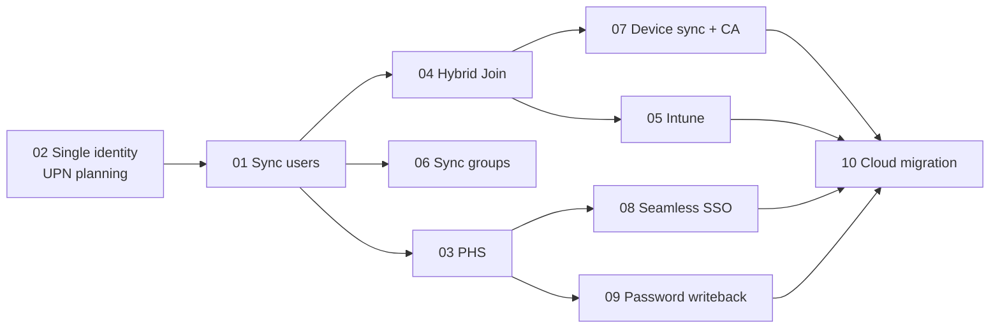

# Microsoft Entra Connect – Hybrid Identity Playbook

Microsoft Entra Connect (formerly **Azure AD Connect**) synchronizes identities from on-premises Active Directory Domain Services (AD DS) to Microsoft Entra ID (formerly **Azure Active Directory**). It provides the identity foundation for Microsoft 365, Intune, Conditional Access, and a staged move to cloud-only identity.

This folder holds ten topic guides. Every guide uses the same template:

1. Overview
2. Architecture
3. Prerequisites
4. Step-by-step workflow
5. PowerShell reference
6. Enterprise lab
7. Troubleshooting
8. Security
9. Exam notes
10. References

All ten guides use the shared **Contoso Healthcare** lab defined below.

> [!NOTE]
> **Recent changes that affect every topic**
> - **Download:** the Entra Connect Sync installer is now downloaded only from the **Microsoft Entra admin center** (**Entra ID > Entra Connect > Get started**), not the Microsoft Download Center.
> - **Mandatory upgrade:** by **April 7, 2027**, every Connect Sync server must run **version 2.6.84.0 or later** and use **application-based authentication** to Microsoft Entra ID, or synchronization stops. This replaces the legacy `Sync_*` / DSA service account.
> - **Version retirement:** since March 15, 2023, each version is retired 12 months after a newer version is released. Keep servers current.
> - **Group writeback:** Group Writeback v2 in Connect Sync is deprecated. Cloud security groups are now written back with **Microsoft Entra Cloud Sync – Group Provision to AD** (see [06](./06-Synchronize-Groups/README.md)).

---

## Topics

| # | Topic | What you learn | Key exam objective |
|---|---|---|---|
| 01 | [Synchronize Users to Microsoft 365](./01-Synchronize-Users-to-Microsoft-365/README.md) | Install Connect Sync, OU/attribute filtering, sourceAnchor, soft/hard match, group-based licensing | SC-300: implement hybrid identity |
| 02 | [Single Identity – Same Username & Password](./02-Single-Identity-Same-Username-Password/README.md) | UPN suffix planning, non-routable domains, one identity across on-premises and cloud | SC-300 / MD-102 |
| 03 | [Password Hash Synchronization](./03-Password-Hash-Synchronization/README.md) | Hashing process, 2-minute interval, leaked credentials, PHS as a backup, cloud password policy | SC-300: authentication methods |
| 04 | [Hybrid Microsoft Entra Join](./04-Hybrid-Microsoft-Entra-Join/README.md) | SCP, managed vs. federated flow, targeted rollout, `dsregcmd` states | MD-102: device identity |
| 05 | [Integrate with Intune](./05-Integrate-with-Intune/README.md) | GPO auto-enrollment, MDM user scope, co-management, enrollment validation | MD-102: enroll devices |
| 06 | [Synchronize Groups](./06-Synchronize-Groups/README.md) | Security/distribution/mail-enabled groups, nesting, group writeback options, limits | SC-300: groups |
| 07 | [Device Synchronization](./07-Device-Synchronization/README.md) | Device sync and writeback, CA with hybrid joined + compliant devices, Zero Trust | SC-300 / MD-102: Conditional Access |
| 08 | [Seamless SSO](./08-Seamless-SSO/README.md) | `AZUREADSSOACC`, Kerberos key rollover, Intranet zone GPO, browser support | SC-300: hybrid authentication |
| 09 | [Password Writeback](./09-Password-Writeback/README.md) | AD permissions, SSPR integration, P1 requirement, end-to-end test | SC-300: SSPR |
| 10 | [Support Cloud Migration](./10-Support-Cloud-Migration/README.md) | Staged rollout, AD FS → PHS, Hybrid Join → Entra Join, phased plan with rollback | SC-300 / MD-102 |

---

## Recommended learning order



| Phase | Topics | Why this order |
|---|---|---|
| 1 – Identity foundation | 02 → 01 | Fix UPNs *before* the first sync. Changing the sourceAnchor or UPN later is expensive. |
| 2 – Authentication | 03 → 08 → 09 | PHS is the recommended sign-in method. Seamless SSO and writeback build on it. |
| 3 – Groups | 06 | Groups drive licensing, Intune targeting, and CA scoping in every later lab. |
| 4 – Devices | 04 → 07 → 05 | Device identity comes first, then device-based CA, then MDM enrollment. |
| 5 – Modernize | 10 | Remove on-premises dependencies once everything above is stable. |

---

## Shared lab environment – Contoso Healthcare

Contoso Healthcare has about **5,000 users** across a head office (Seattle), two hospitals (Portland and Spokane), and 12 clinics. Clinicians share workstations, and admin staff use assigned laptops. Every lab in this folder runs on the environment below.

### On-premises

| Component | Name | Spec / notes |
|---|---|---|
| AD forest / domain | `contoso.local` | Forest functional level Windows Server 2016. Non-routable DNS name, so an alternate UPN suffix `contoso.com` is added. |
| Domain controller 1 | `CON-DC01` (10.10.0.10) | Windows Server 2022, PDC emulator, GC, DNS |
| Domain controller 2 | `CON-DC02` (10.10.0.11) | Windows Server 2022, GC, DNS |
| Entra Connect (active) | `CON-ECS01` (10.10.0.20) | Windows Server 2022, 4 vCPU / 8 GB RAM, SQL Express LocalDB, **Tier 0** |
| Entra Connect (staging) | `CON-ECS02` (10.10.0.21) | Same build as ECS01, **staging mode enabled** |
| Clients | `CON-WS-xxxx` | Windows 11 Enterprise 23H2/24H2, domain-joined |

### OU design

```text
contoso.local
├── Corp
│   ├── Users
│   │   ├── Clinical
│   │   ├── Finance
│   │   ├── HR
│   │   └── IT
│   ├── Groups
│   ├── Workstations
│   │   ├── Pilot          <- targeted rollout OU (Hybrid Join, Intune)
│   │   └── Production
│   ├── Servers
│   └── Service Accounts
├── Non-Synced              <- excluded by OU filtering (break-glass, test, legacy)
└── Domain Controllers
```

### Cloud

| Item | Value |
|---|---|
| Tenant | `contoso.onmicrosoft.com`, verified custom domain `contoso.com` |
| Licensing | Microsoft 365 E5 (or E3 + EMS E3/E5) |
| Services used | Exchange Online, Intune, Conditional Access, Entra ID Protection, Entra Connect Health |
| Break-glass | Two cloud-only Global Administrator accounts (`bg01@contoso.onmicrosoft.com`, `bg02@…`), excluded from CA, FIDO2-protected |

### Test users and groups

| User | Department | OU | Purpose |
|---|---|---|---|
| `alex.wilber@contoso.com` | Clinical | Corp/Users/Clinical | Standard pilot user |
| `megan.bowen@contoso.com` | Finance | Corp/Users/Finance | SSPR / writeback tests |
| `lee.gu@contoso.com` | IT | Corp/Users/IT | Admin-tier testing |
| `test.legacy@contoso.local` | – | Non-Synced | Must *never* appear in Entra ID |

| Group | Type | Use |
|---|---|---|
| `GRP-Pilot-Users` | Security (global) | Staged rollout, Intune pilot |
| `GRP-Lic-M365E5` | Security (global) | Group-based licensing |
| `GRP-Pilot-Devices` | Security (global) | Hybrid Join / Intune device pilot |
| `DL-Clinical-All` | Distribution | Exchange distribution list |

### Licensing summary

> [!WARNING]
> Several features in these labs need more than basic Entra ID Free licensing:
>
> | Feature | Minimum license |
> |---|---|
> | Directory sync, PHS, Seamless SSO, Hybrid Join | Entra ID Free (included with any Microsoft 365 subscription) |
> | Password writeback, SSPR with on-premises writeback | **Entra ID P1** |
> | Conditional Access, device writeback, group writeback (Cloud Sync), group-based licensing | **Entra ID P1** |
> | Risk-based CA, leaked credential *policies* (ID Protection) | **Entra ID P2** |
> | Entra Connect Health | **Entra ID P1** (the first agent needs 1 license, and each additional agent needs 25 more) |
> | Intune MDM / co-management | Intune Plan 1 (included in M365 E3/E5 and EMS) |

---

## Conventions used in these guides

- **Paths:** `Entra admin center` means <https://entra.microsoft.com>, and `Intune admin center` means <https://intune.microsoft.com>.
- **Server:** run all PowerShell on `CON-ECS01` unless stated otherwise. The ADSync module is installed with Entra Connect at `C:\Program Files\Microsoft Azure AD Sync\Bin\ADSync`.
- **Callouts:** `> [!NOTE]` marks recent product changes, `> [!TIP]` marks field-proven shortcuts, and `> [!WARNING]` marks actions that can cause outages or data loss.
- **References:** only official Microsoft Learn documentation is linked.
